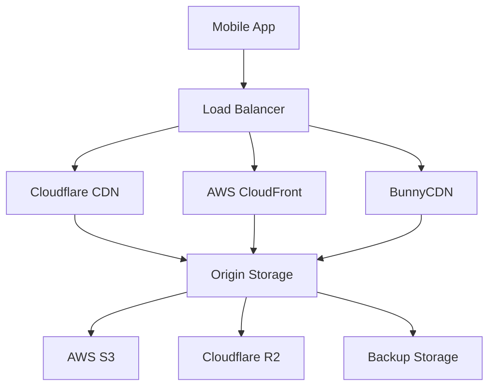
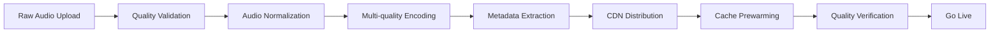

# DeenMate Backend API Layer - CDN & Audio Delivery Architecture

**Date**: September 3, 2025  
**Purpose**: Design scalable audio delivery system for Quran recitations and Islamic content  
**Framework**: CDN-optimized streaming with global edge distribution  

---

## Executive Summary

This document outlines a comprehensive Content Delivery Network (CDN) and audio streaming architecture for DeenMate's Islamic audio content. The system is designed to deliver high-quality Quran recitations, Adhan calls, and educational audio globally with minimal latency and optimal cost efficiency.

---

## 1. Audio Content Overview

### 1.1 Content Inventory

| Audio Type | Size Range | Quality | Total Content | Annual Growth |
|------------|------------|---------|---------------|---------------|
| **Quran Recitations** | 500MB-2GB/reciter | 128-320kbps | ~200 reciters | +20 reciters |
| **Chapter Recitations** | 5-50MB/chapter | 128kbps | 114 chapters × 200 | +2,280 files |
| **Verse-by-verse** | 10-200KB/verse | 64kbps | 6,236 verses × 200 | +1.25M files |
| **Adhan Calls** | 2-5MB/call | 128kbps | ~50 variations | +10 annually |
| **Dua Collections** | 30s-5min | 96kbps | ~500 duas | +100 annually |
| **Educational Content** | 5-60min | 96kbps | ~1,000 lectures | +500 annually |

**Total Storage Requirement**: ~2-5TB initially, growing to 10TB+ annually

### 1.2 Quality Standards

**Audio Formats**:
- **Primary**: AAC 128kbps (mobile-optimized)
- **High Quality**: AAC 256kbps (premium users)
- **Fallback**: MP3 128kbps (compatibility)

**Encoding Standards**:
```yaml
audio_encoding:
  sample_rate: 44100  # CD quality
  bit_depth: 16
  channels: 2         # Stereo for music, mono for speech
  format: AAC-LC      # iOS/Android optimized
  
  quality_levels:
    low: 64kbps       # Data-saving mode
    standard: 128kbps # Default quality
    high: 256kbps     # Premium quality
    lossless: FLAC    # Archive/master quality
```

---

## 2. CDN Architecture Design

### 2.1 Multi-CDN Strategy

**Primary CDN**: Cloudflare (Global coverage + Islamic content friendly)  
**Secondary CDN**: AWS CloudFront (Reliability + integration)  
**Tertiary CDN**: BunnyCDN (Cost efficiency + performance)



### 2.2 Geographic Distribution

**Global Edge Locations**:
```yaml
primary_regions:
  - middle_east:      # Saudi Arabia, UAE, Qatar
      locations: 15
      priority: highest
      cache_ttl: 30 days
      
  - south_asia:       # India, Pakistan, Bangladesh
      locations: 20
      priority: highest  
      cache_ttl: 30 days
      
  - southeast_asia:   # Indonesia, Malaysia, Singapore
      locations: 12
      priority: high
      cache_ttl: 14 days

secondary_regions:
  - north_america:    # USA, Canada
      locations: 25
      priority: medium
      cache_ttl: 7 days
      
  - europe:           # UK, Germany, France
      locations: 30
      priority: medium
      cache_ttl: 7 days
      
  - africa:           # Egypt, Nigeria, South Africa
      locations: 8
      priority: medium
      cache_ttl: 14 days
```

### 2.3 Smart Routing Logic

**CDN Selection Algorithm**:
```javascript
function selectOptimalCDN(userLocation, contentType, userTier) {
  const cdnPerformance = {
    cloudflare: {
      latency: getLatency(userLocation, 'cloudflare'),
      reliability: 99.9,
      cost: 0.08,  // per GB
      islamicContentFriendly: true
    },
    cloudfront: {
      latency: getLatency(userLocation, 'cloudfront'),
      reliability: 99.95,
      cost: 0.12,
      islamicContentFriendly: true
    },
    bunnycdn: {
      latency: getLatency(userLocation, 'bunnycdn'),
      reliability: 99.8,
      cost: 0.01,
      islamicContentFriendly: true
    }
  };
  
  // Score each CDN
  const scores = Object.entries(cdnPerformance).map(([name, metrics]) => {
    let score = 0;
    
    // Latency weight (40%)
    score += (200 - metrics.latency) * 0.4;
    
    // Reliability weight (30%)
    score += metrics.reliability * 0.3;
    
    // Cost efficiency weight (20%)
    score += (0.2 - metrics.cost) * 100 * 0.2;
    
    // Content policy weight (10%)
    score += metrics.islamicContentFriendly ? 10 : 0;
    
    return { name, score, metrics };
  });
  
  // Return best scoring CDN
  return scores.sort((a, b) => b.score - a.score)[0];
}
```

---

## 3. Storage Architecture

### 3.1 Multi-Tier Storage Strategy

**Hot Storage** (Frequently accessed):
- **Platform**: Cloudflare R2 + AWS S3
- **Content**: Popular reciters, daily prayers
- **TTL**: Immediate availability
- **Cost**: $0.015/GB/month

**Warm Storage** (Occasionally accessed):
- **Platform**: AWS S3 Standard-IA
- **Content**: Complete Quran collections
- **TTL**: <1 second retrieval
- **Cost**: $0.0125/GB/month

**Cold Storage** (Archive/backup):
- **Platform**: AWS S3 Glacier
- **Content**: Master recordings, old versions
- **TTL**: 1-5 minutes retrieval
- **Cost**: $0.004/GB/month

### 3.2 Storage Organization

**Directory Structure**:
```
audio-cdn/
├── quran/
│   ├── reciters/
│   │   ├── abdurrahman-as-sudais/
│   │   │   ├── 128kbps/
│   │   │   │   ├── 001.aac          # Al-Fatihah
│   │   │   │   ├── 002.aac          # Al-Baqarah
│   │   │   │   └── ...
│   │   │   ├── 256kbps/
│   │   │   └── metadata.json
│   │   ├── sheikh-maher/
│   │   └── ...
│   ├── translations/
│   │   ├── audio-translations/
│   │   │   ├── english/
│   │   │   ├── bengali/
│   │   │   └── urdu/
│   └── tafsir/
├── adhan/
│   ├── traditional/
│   ├── modern/
│   └── regional/
├── duas/
│   ├── daily/
│   ├── special-occasions/
│   └── categories/
└── educational/
    ├── lectures/
    ├── learning/
    └── children/
```

**File Naming Convention**:
```javascript
const audioFileNaming = {
  quran: {
    pattern: "{reciter_id}/{quality}/{chapter:003d}_{verse:003d}.{format}",
    example: "sudais/128kbps/001_001.aac"
  },
  
  chapters: {
    pattern: "{reciter_id}/{quality}/chapter_{chapter:003d}.{format}",
    example: "sudais/128kbps/chapter_001.aac"
  },
  
  adhan: {
    pattern: "adhan/{style}/{location}_{quality}.{format}",
    example: "adhan/traditional/makkah_128kbps.aac"
  },
  
  duas: {
    pattern: "duas/{category}/{dua_id}_{quality}.{format}",
    example: "duas/daily/morning_128kbps.aac"
  }
};
```

### 3.3 Metadata Management

**Audio Metadata Schema**:
```json
{
  "file_id": "sudais_001_001_128k",
  "content_type": "quran_verse",
  "reciter": {
    "id": "abdurrahman-as-sudais",
    "name": "Sheikh Abdul Rahman As-Sudais",
    "biography": "Imam of Masjid al-Haram",
    "style": "traditional"
  },
  "location": {
    "chapter": 1,
    "verse": 1,
    "chapter_name": "Al-Fatihah",
    "verse_text": "بِسْمِ اللَّهِ الرَّحْمَٰنِ الرَّحِيمِ"
  },
  "audio_specs": {
    "format": "aac",
    "quality": "128kbps",
    "duration_seconds": 8.5,
    "file_size_bytes": 136000,
    "sample_rate": 44100,
    "channels": 1
  },
  "cdn_urls": {
    "cloudflare": "https://audio-cdn.deenmate.app/quran/sudais/128kbps/001_001.aac",
    "cloudfront": "https://d1234567890.cloudfront.net/quran/sudais/128kbps/001_001.aac",
    "bunnycdn": "https://deenmate-audio.b-cdn.net/quran/sudais/128kbps/001_001.aac"
  },
  "cache_settings": {
    "ttl_seconds": 2592000,  // 30 days
    "edge_caching": true,
    "browser_caching": true
  },
  "created_at": "2025-09-03T10:00:00Z",
  "updated_at": "2025-09-03T10:00:00Z"
}
```

---

## 4. Streaming & Progressive Loading

### 4.1 Adaptive Streaming Strategy

**Quality Selection Logic**:
```javascript
function selectAudioQuality(connectionSpeed, batteryLevel, dataMode) {
  const qualityMap = {
    'wifi_fast': '256kbps',      // >10 Mbps
    'wifi_medium': '128kbps',    // 2-10 Mbps  
    'wifi_slow': '64kbps',       // <2 Mbps
    '4g_unlimited': '128kbps',
    '4g_limited': '64kbps',
    '3g': '64kbps',
    '2g': '32kbps'
  };
  
  let selectedQuality = qualityMap[connectionSpeed] || '128kbps';
  
  // Adjust for data saving mode
  if (dataMode === 'save_data') {
    selectedQuality = '64kbps';
  }
  
  // Adjust for low battery
  if (batteryLevel < 20) {
    selectedQuality = '64kbps';
  }
  
  return selectedQuality;
}
```

### 4.2 Progressive Audio Loading

**Chunk-based Streaming**:
```javascript
class ProgressiveAudioLoader {
  constructor(audioUrl, chunkSize = 64 * 1024) { // 64KB chunks
    this.audioUrl = audioUrl;
    this.chunkSize = chunkSize;
    this.loadedChunks = new Map();
    this.totalSize = null;
  }
  
  async loadChunk(chunkIndex) {
    const start = chunkIndex * this.chunkSize;
    const end = start + this.chunkSize - 1;
    
    const response = await fetch(this.audioUrl, {
      headers: {
        'Range': `bytes=${start}-${end}`
      }
    });
    
    if (response.status === 206) { // Partial Content
      const chunk = await response.arrayBuffer();
      this.loadedChunks.set(chunkIndex, chunk);
      return chunk;
    }
    
    throw new Error('Range requests not supported');
  }
  
  async preloadCriticalChunks() {
    // Load first 3 chunks for immediate playback
    const promises = [0, 1, 2].map(i => this.loadChunk(i));
    await Promise.all(promises);
  }
}
```

### 4.3 Audio Buffering Strategy

**Smart Buffering**:
```javascript
const bufferingConfig = {
  // Minimum buffer before playback starts
  initialBuffer: 3, // seconds
  
  // Maintain buffer during playback
  maintainBuffer: 10, // seconds
  
  // Maximum buffer to prevent memory issues
  maxBuffer: 30, // seconds
  
  // Rebuffer threshold
  rebufferThreshold: 2, // seconds
  
  // Quality adjustment thresholds
  qualityUpThreshold: 15, // seconds of healthy buffer
  qualityDownThreshold: 5   // seconds before reducing quality
};
```

---

## 5. Authentication & Security

### 5.1 Signed URLs for Premium Content

**URL Signing Implementation**:
```javascript
const crypto = require('crypto');

function generateSignedUrl(filePath, expirationMinutes = 60, userTier = 'free') {
  const baseUrl = 'https://audio-cdn.deenmate.app';
  const secretKey = process.env.CDN_SIGNING_KEY;
  
  // Check access permissions
  if (!hasAccessToContent(filePath, userTier)) {
    throw new Error('Insufficient permissions');
  }
  
  const expiration = Math.floor(Date.now() / 1000) + (expirationMinutes * 60);
  const stringToSign = `${filePath}:${expiration}`;
  
  const signature = crypto
    .createHmac('sha256', secretKey)
    .update(stringToSign)
    .digest('hex')
    .substring(0, 16); // Truncate for shorter URLs
  
  return `${baseUrl}${filePath}?expires=${expiration}&signature=${signature}`;
}

function hasAccessToContent(filePath, userTier) {
  // Free tier: Basic reciters only
  if (userTier === 'free') {
    const freeReciters = ['sudais', 'mishary', 'husary'];
    return freeReciters.some(reciter => filePath.includes(reciter));
  }
  
  // Premium: All content
  if (userTier === 'premium') {
    return true;
  }
  
  return false;
}
```

### 5.2 Rate Limiting & Abuse Prevention

**Per-User Limits**:
```yaml
rate_limits:
  free_tier:
    audio_downloads: 100/hour
    bandwidth: 500MB/hour
    concurrent_streams: 2
    
  premium_tier:
    audio_downloads: 1000/hour
    bandwidth: 5GB/hour
    concurrent_streams: 5
    
  api_access:
    requests: 1000/hour
    burst: 100/minute
```

**Implementation**:
```javascript
class AudioRateLimiter {
  constructor(redis) {
    this.redis = redis;
  }
  
  async checkLimit(userId, userTier, requestType) {
    const limits = this.getLimitsForTier(userTier);
    const key = `rate_limit:${userId}:${requestType}`;
    
    const current = await this.redis.incr(key);
    
    if (current === 1) {
      await this.redis.expire(key, 3600); // 1 hour window
    }
    
    if (current > limits[requestType]) {
      throw new Error(`Rate limit exceeded for ${requestType}`);
    }
    
    return {
      allowed: true,
      remaining: limits[requestType] - current,
      resetTime: await this.redis.ttl(key)
    };
  }
}
```

---

## 6. Offline Caching Strategy

### 6.1 Mobile App Caching

**Cache Hierarchy**:
```javascript
const cacheStrategy = {
  // Level 1: Memory cache (playing audio)
  memoryCache: {
    maxSize: '50MB',
    ttl: 30 * 60, // 30 minutes
    priority: 'recently_played'
  },
  
  // Level 2: Disk cache (downloaded content)
  diskCache: {
    maxSize: '2GB',
    ttl: 30 * 24 * 60 * 60, // 30 days
    priority: 'user_selected'
  },
  
  // Level 3: Temporary cache (streaming chunks)
  streamCache: {
    maxSize: '100MB',
    ttl: 60 * 60, // 1 hour
    priority: 'fifo'
  }
};
```

### 6.2 Smart Pre-caching

**Predictive Caching Logic**:
```javascript
async function predictiveCache(userId, prayerTimes, userPreferences) {
  const cacheList = [];
  
  // 1. Upcoming prayer Adhan
  const nextPrayer = getNextPrayer(prayerTimes);
  const userAdhanStyle = userPreferences.adhanStyle || 'makkah';
  cacheList.push(`adhan/${userAdhanStyle}/128kbps.aac`);
  
  // 2. User's favorite reciter for next prayer's surahs
  const favoriteReciter = userPreferences.favoriteReciter || 'sudais';
  if (nextPrayer === 'fajr') {
    // Cache common Fajr surahs
    cacheList.push(`quran/${favoriteReciter}/128kbps/001.aac`); // Al-Fatihah
    cacheList.push(`quran/${favoriteReciter}/128kbps/067.aac`); // Al-Mulk
  }
  
  // 3. Daily duas
  if (nextPrayer === 'fajr') {
    cacheList.push('duas/morning/128kbps.aac');
  } else if (nextPrayer === 'maghrib') {
    cacheList.push('duas/evening/128kbps.aac');
  }
  
  // 4. Weekly content (if Friday)
  if (new Date().getDay() === 5) { // Friday
    cacheList.push('duas/jumah/128kbps.aac');
  }
  
  return cacheList;
}
```

---

## 7. Performance Optimization

### 7.1 CDN Cache Configuration

**Cache Rules by Content Type**:
```nginx
# Cloudflare Page Rules
location ~* \.(aac|mp3|m4a)$ {
    # Audio files - long cache
    expires 30d;
    add_header Cache-Control "public, no-transform, immutable";
    add_header Vary "Accept-Encoding";
    
    # Enable Cloudflare caching
    add_header CF-Cache-Tag "audio";
}

location ~* metadata\.json$ {
    # Metadata - shorter cache
    expires 1d;
    add_header Cache-Control "public, must-revalidate";
    
    # Enable edge-side includes for dynamic content
    add_header CF-Cache-Tag "metadata";
}

location ~* playlist\.m3u8$ {
    # Playlists - no cache
    expires -1;
    add_header Cache-Control "no-cache, no-store, must-revalidate";
}
```

### 7.2 Compression & Optimization

**Audio Compression Pipeline**:
```javascript
const ffmpeg = require('fluent-ffmpeg');

async function optimizeAudioFile(inputPath, outputPath, quality = '128k') {
  return new Promise((resolve, reject) => {
    ffmpeg(inputPath)
      .audioCodec('aac')
      .audioBitrate(quality)
      .audioChannels(1)        // Mono for speech content
      .audioFrequency(44100)   // Standard sample rate
      .format('aac')
      .outputOptions([
        '-movflags +faststart', // Optimize for streaming
        '-preset slow',         // Better compression
        '-profile:a aac_low'    // Mobile compatibility
      ])
      .output(outputPath)
      .on('end', resolve)
      .on('error', reject)
      .run();
  });
}
```

### 7.3 Bandwidth Optimization

**Adaptive Bandwidth Management**:
```javascript
class BandwidthOptimizer {
  constructor() {
    this.connectionMonitor = new ConnectionMonitor();
    this.qualityAdjuster = new QualityAdjuster();
  }
  
  async optimizeForConnection(audioRequest) {
    const connection = await this.connectionMonitor.getCurrentConnection();
    
    if (connection.effectiveBandwidth < 100) { // <100 kbps
      return this.qualityAdjuster.adjust(audioRequest, '32kbps');
    } else if (connection.effectiveBandwidth < 500) { // <500 kbps
      return this.qualityAdjuster.adjust(audioRequest, '64kbps');
    } else if (connection.effectiveBandwidth < 2000) { // <2 Mbps
      return this.qualityAdjuster.adjust(audioRequest, '128kbps');
    } else {
      return this.qualityAdjuster.adjust(audioRequest, '256kbps');
    }
  }
}
```

---

## 8. Cost Management

### 8.1 Cost Structure Analysis

**Monthly Cost Breakdown** (for 100k active users):

| Service | Usage | Unit Cost | Monthly Cost |
|---------|-------|-----------|--------------|
| **Cloudflare R2** | 5TB storage | $0.015/GB | $75 |
| **Cloudflare Bandwidth** | 50TB transfer | $0.01/GB | $500 |
| **AWS S3 (backup)** | 5TB storage | $0.023/GB | $115 |
| **CloudFront** | 20TB transfer | $0.085/GB | $1,700 |
| **BunnyCDN** | 30TB transfer | $0.01/GB | $300 |
| **Transcoding** | 500 hours | $0.0125/min | $375 |
| **Total** | | | **$3,065/month** |

**Cost per User**: $0.03/month

### 8.2 Cost Optimization Strategies

**Tiered Pricing Model**:
```yaml
user_tiers:
  free:
    audio_quality: 64kbps
    monthly_bandwidth: 500MB
    content_access: basic_reciters
    ads: enabled
    
  premium:
    audio_quality: 256kbps
    monthly_bandwidth: 5GB
    content_access: all_reciters
    ads: disabled
    price: $2.99/month
    
  family:
    audio_quality: 256kbps
    monthly_bandwidth: 20GB
    content_access: all_reciters
    concurrent_devices: 5
    price: $7.99/month
```

**Auto-scaling Cost Controls**:
```javascript
async function monitorAndOptimizeCosts() {
  const monthlyUsage = await getMonthlyUsage();
  
  // If bandwidth usage exceeds budget
  if (monthlyUsage.bandwidth > TARGET_BANDWIDTH_GB) {
    // Temporarily reduce quality for free users
    await adjustQualityForTier('free', '32kbps');
    
    // Increase cache TTL to reduce origin requests
    await increaseCacheTTL('audio_files', '7d');
    
    // Alert admin
    await sendAlert('Bandwidth usage exceeding budget', monthlyUsage);
  }
  
  // Optimize storage costs
  if (monthlyUsage.storage > TARGET_STORAGE_GB) {
    // Move old content to cold storage
    await moveToColderStorage(30); // files older than 30 days
  }
}
```

---

## 9. Analytics & Monitoring

### 9.1 Key Performance Indicators

**Audio Delivery Metrics**:
```javascript
const audioMetrics = {
  // Performance metrics
  'audio_request_duration_ms': new Histogram(),
  'audio_buffer_health_seconds': new Gauge(),
  'cdn_cache_hit_ratio': new Gauge(),
  'audio_quality_distribution': new Counter(),
  
  // User experience metrics
  'playback_start_time_ms': new Histogram(),
  'rebuffering_events_total': new Counter(),
  'audio_completion_rate': new Gauge(),
  'user_quality_satisfaction': new Gauge(),
  
  // Business metrics
  'bandwidth_usage_gb': new Counter(),
  'storage_costs_usd': new Gauge(),
  'premium_conversion_rate': new Gauge(),
  'content_popularity_rank': new Gauge()
};
```

### 9.2 Real-time Monitoring Dashboard

**Grafana Dashboard Panels**:
```yaml
dashboard_panels:
  - title: "Global CDN Performance"
    metrics:
      - cdn_response_time_by_region
      - cache_hit_ratio_by_content_type
      - bandwidth_usage_by_tier
      
  - title: "Audio Quality & UX"
    metrics:
      - average_buffer_health
      - rebuffering_rate_by_quality
      - playback_success_rate
      
  - title: "Cost Monitoring"
    metrics:
      - daily_bandwidth_costs
      - storage_growth_trend
      - cost_per_active_user
      
  - title: "Content Popularity"
    metrics:
      - top_reciters_by_requests
      - peak_usage_times
      - geographic_usage_distribution
```

---

## 10. Content Management & Workflow

### 10.1 Audio Content Pipeline

**Upload & Processing Workflow**:


**Automated Processing Script**:
```javascript
async function processNewAudioContent(uploadedFile) {
  const processingId = generateProcessingId();
  
  try {
    // 1. Validate audio file
    const validation = await validateAudioFile(uploadedFile);
    if (!validation.isValid) {
      throw new Error(`Validation failed: ${validation.errors.join(', ')}`);
    }
    
    // 2. Extract metadata
    const metadata = await extractAudioMetadata(uploadedFile);
    
    // 3. Generate multiple quality versions
    const qualities = ['32kbps', '64kbps', '128kbps', '256kbps'];
    const encodedFiles = await Promise.all(
      qualities.map(quality => encodeAudio(uploadedFile, quality))
    );
    
    // 4. Upload to storage
    const storageUrls = await uploadToStorage(encodedFiles);
    
    // 5. Distribute to CDNs
    await distributeToCDNs(storageUrls);
    
    // 6. Update database
    await updateAudioDatabase(metadata, storageUrls);
    
    // 7. Prewarm cache for popular content
    if (metadata.reciter.popularity > 0.8) {
      await prewarmCDNCache(storageUrls);
    }
    
    logger.info(`Audio processing completed for ${processingId}`);
    
  } catch (error) {
    logger.error(`Audio processing failed for ${processingId}:`, error);
    await cleanupFailedProcessing(processingId);
    throw error;
  }
}
```

### 10.2 Content Curation Guidelines

**Audio Quality Standards**:
- **Signal-to-Noise Ratio**: Minimum 40dB
- **Dynamic Range**: 12-20dB for speech content
- **Peak Levels**: -6dB max to prevent clipping
- **Background Noise**: <-60dB
- **Frequency Response**: 80Hz-12kHz for speech, 20Hz-20kHz for music

**Content Approval Workflow**:
1. **Islamic Scholar Review**: Theological accuracy
2. **Audio Engineer Review**: Technical quality
3. **Community Feedback**: Beta testing with trusted users
4. **Legal Review**: Copyright and licensing
5. **Final Approval**: Release to production

---

## 11. Disaster Recovery & Backup

### 11.1 Multi-Region Backup Strategy

**Backup Locations**:
```yaml
backup_strategy:
  primary_backup:
    location: us-east-1
    type: real-time_sync
    retention: 90_days
    
  secondary_backup:
    location: eu-west-1
    type: daily_snapshot
    retention: 30_days
    
  cold_backup:
    location: glacier
    type: monthly_archive
    retention: 7_years
```

### 11.2 Recovery Procedures

**Recovery Time Objectives (RTO)**:
- **Critical Content** (Top 100 reciters): 15 minutes
- **Standard Content** (All Quran): 4 hours
- **Supplementary Content** (Duas, lectures): 24 hours

**Recovery Automation**:
```bash
#!/bin/bash
# disaster_recovery.sh

case $1 in
  "cdn_failure")
    echo "Switching to backup CDN..."
    # Update DNS to point to backup CDN
    aws route53 change-resource-record-sets --hosted-zone-id Z123 \
      --change-batch file://backup-cdn-records.json
    ;;
    
  "storage_failure")
    echo "Restoring from backup storage..."
    # Sync from backup to new primary storage
    aws s3 sync s3://deenmate-backup-audio/ s3://deenmate-primary-audio/ \
      --exclude "*.tmp" --include "*.aac"
    ;;
    
  "complete_failure")
    echo "Full disaster recovery initiated..."
    # Execute complete restoration procedure
    ./restore_infrastructure.sh
    ./restore_audio_content.sh
    ./validate_recovery.sh
    ;;
esac
```

---

## 12. Implementation Roadmap

### 12.1 Phase 1: Foundation (Week 1-2)

**Core Infrastructure**:
- [ ] Set up Cloudflare R2 primary storage
- [ ] Configure CloudFront distribution
- [ ] Implement basic CDN routing
- [ ] Create audio metadata database schema
- [ ] Set up basic monitoring

**Initial Content**:
- [ ] Upload top 10 reciters (128kbps quality)
- [ ] Implement signed URL generation
- [ ] Basic mobile app integration

### 12.2 Phase 2: Optimization (Week 3-4)

**Performance Features**:
- [ ] Multi-quality audio encoding
- [ ] Progressive loading implementation
- [ ] Smart caching algorithms
- [ ] Bandwidth optimization
- [ ] Advanced monitoring dashboard

**Content Expansion**:
- [ ] Add remaining reciters
- [ ] Implement Adhan collection
- [ ] Add Dua collections
- [ ] Educational content upload

### 12.3 Phase 3: Advanced Features (Week 5-6)

**Premium Features**:
- [ ] Advanced audio analytics
- [ ] Predictive caching
- [ ] A/B testing framework
- [ ] Cost optimization automation
- [ ] Complete disaster recovery testing

**Scale Preparation**:
- [ ] Load testing with 100k concurrent users
- [ ] Cost modeling for growth scenarios
- [ ] Performance tuning and optimization

---

**Architecture Completed**: September 3, 2025  
**Ready for Implementation**: Complete CDN strategy with cost projections  
**Estimated Development Time**: 6 weeks for full implementation  
**Monthly Operating Cost**: $3,065 for 100k users ($0.03/user)
