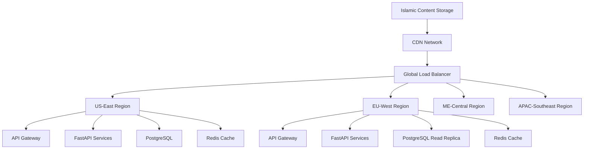

# DeenMate Backend API Layer - Infrastructure Costs & Recommendations

**Date**: September 3, 2025  
**Purpose**: Infrastructure architecture, deployment recommendations, and cost analysis  
**Framework**: Scalable, cost-effective infrastructure for Islamic content delivery  

---

## Executive Summary

This document provides comprehensive infrastructure recommendations for DeenMate's backend API services, including technology stack selection, deployment architecture, scaling strategies, and detailed cost analysis for different user scale scenarios. The recommendations prioritize reliability, performance, and cost-effectiveness while serving the global Muslim community.

---

## 1. Infrastructure Architecture Overview

### 1.1 Recommended Technology Stack

**Backend Framework Selection**:
```yaml
backend_framework_comparison:
  fastapi_python:
    pros:
      - "Excellent for Islamic content APIs"
      - "Strong typing with Pydantic"
      - "Automatic OpenAPI documentation"
      - "Great async performance"
      - "Rich ecosystem for ML/AI features"
    cons:
      - "Python performance limitations"
      - "Higher memory usage"
    recommendation: "Primary choice for MVP and v1"
    
  nestjs_typescript:
    pros:
      - "Enterprise-grade architecture"
      - "Excellent TypeScript support"
      - "Modular design"
      - "Great for team development"
    cons:
      - "Steeper learning curve"
      - "More complex setup"
    recommendation: "Consider for v2 scaling"
    
  express_nodejs:
    pros:
      - "Simple and lightweight"
      - "Large ecosystem"
      - "Fast development"
    cons:
      - "Less structured"
      - "Manual API documentation"
    recommendation: "Not recommended for complex API"
    
  dotnet_core:
    pros:
      - "Excellent performance"
      - "Strong typing"
      - "Enterprise features"
    cons:
      - "Microsoft ecosystem lock-in"
      - "Higher complexity"
    recommendation: "Future consideration"
```

**Recommended Stack: FastAPI + Python**:
```python
# Primary Technology Stack
TECHNOLOGY_STACK = {
    "api_framework": "FastAPI 0.104+",
    "runtime": "Python 3.11+",
    "async_framework": "asyncio + uvloop",
    "web_server": "Uvicorn with Gunicorn",
    "database": "PostgreSQL 15+",
    "cache": "Redis 7+",
    "message_queue": "Redis + Celery",
    "search": "Elasticsearch 8+",
    "monitoring": "Prometheus + Grafana",
    "logging": "Structured logging with ELK",
    "container": "Docker + Kubernetes",
    "cloud_provider": "AWS (primary) + Cloudflare"
}
```

### 1.2 Deployment Architecture

**Multi-Region Deployment Strategy**:


**Container Orchestration**:
```yaml
kubernetes_architecture:
  cluster_configuration:
    node_pools:
      api_nodes:
        machine_type: "t3.large" # 2 vCPU, 8GB RAM
        min_nodes: 2
        max_nodes: 10
        scaling_metric: "cpu_utilization > 70%"
        
      cache_nodes:
        machine_type: "r6g.large" # 2 vCPU, 16GB RAM (memory optimized)
        min_nodes: 1
        max_nodes: 3
        scaling_metric: "memory_utilization > 80%"
        
      worker_nodes:
        machine_type: "t3.medium" # 2 vCPU, 4GB RAM
        min_nodes: 1
        max_nodes: 5
        scaling_metric: "queue_depth > 100"
        
  services:
    api_service:
      replicas: 3
      resources:
        requests:
          cpu: "200m"
          memory: "512Mi"
        limits:
          cpu: "1000m"
          memory: "2Gi"
      hpa:
        min_replicas: 2
        max_replicas: 20
        target_cpu: 70
        
    cache_service:
      replicas: 2
      resources:
        requests:
          cpu: "100m"
          memory: "1Gi"
        limits:
          cpu: "500m"
          memory: "8Gi"
          
    worker_service:
      replicas: 2
      resources:
        requests:
          cpu: "100m"
          memory: "256Mi"
        limits:
          cpu: "500m"
          memory: "1Gi"
```

---

## 2. Database Infrastructure

### 2.1 PostgreSQL Configuration

**Production Database Setup**:
```yaml
postgresql_configuration:
  primary_database:
    instance_type: "db.r6g.xlarge" # 4 vCPU, 32GB RAM
    storage: "500GB GP3 SSD"
    iops: "3000"
    multi_az: true
    backup_retention: "30 days"
    
  read_replicas:
    count: 2
    instance_type: "db.r6g.large" # 2 vCPU, 16GB RAM
    regions: ["us-west-2", "eu-west-1"]
    
  connection_pooling:
    tool: "PgBouncer"
    max_connections: 100
    pool_size: 25
    pool_mode: "transaction"
    
  performance_tuning:
    shared_buffers: "8GB"
    effective_cache_size: "24GB"
    work_mem: "64MB"
    maintenance_work_mem: "1GB"
    wal_buffers: "64MB"
    checkpoint_completion_target: 0.9
    random_page_cost: 1.1
    effective_io_concurrency: 200
```

**Database Optimization for Islamic Content**:
```sql
-- Specialized indices for Islamic content
CREATE INDEX CONCURRENTLY idx_quran_verses_search 
ON quran_verses USING GIN (to_tsvector('arabic', text_uthmani));

CREATE INDEX CONCURRENTLY idx_quran_verses_chapter_verse 
ON quran_verses (chapter_id, verse_number);

CREATE INDEX CONCURRENTLY idx_hadith_search 
ON hadith_texts USING GIN (to_tsvector('english', text_english), to_tsvector('arabic', text_arabic));

CREATE INDEX CONCURRENTLY idx_prayer_times_location_date 
ON prayer_times (location_hash, prayer_date);

-- Partitioning for large tables
CREATE TABLE prayer_times_y2025m09 PARTITION OF prayer_times
FOR VALUES FROM ('2025-09-01') TO ('2025-10-01');

-- Materialized views for performance
CREATE MATERIALIZED VIEW popular_quran_chapters AS
SELECT chapter_id, COUNT(*) as access_count
FROM quran_access_logs 
WHERE created_at >= NOW() - INTERVAL '30 days'
GROUP BY chapter_id
ORDER BY access_count DESC;
```

### 2.2 Redis Configuration

**Caching Strategy**:
```yaml
redis_configuration:
  primary_cache:
    instance_type: "cache.r6g.xlarge" # 4 vCPU, 25.05GB RAM
    node_count: 2
    cluster_mode: true
    replication: true
    
  cache_policies:
    quran_verses:
      ttl: "7 days"
      eviction: "allkeys-lru"
      max_memory: "80%"
      
    prayer_times:
      ttl: "24 hours"
      eviction: "allkeys-lru"
      
    user_sessions:
      ttl: "1 hour"
      eviction: "volatile-ttl"
      
    api_responses:
      ttl: "15 minutes"
      eviction: "allkeys-lru"
      
  memory_optimization:
    compression: true
    memory_efficient_data_structures: true
    lazy_freeing: true
```

---

## 3. Cost Analysis by Scale

### 3.1 User Scale Scenarios

**Cost Projections by User Base**:

#### **Scenario 1: MVP Launch (10,000 users)**
```yaml
mvp_10k_users:
  monthly_active_users: 10000
  daily_active_users: 3000
  api_requests_per_month: 5000000
  audio_streaming_gb: 500
  
  infrastructure_costs:
    compute:
      - eks_cluster: $150 # 3 t3.medium nodes
      - api_services: $200 # 2 t3.large instances
      - worker_services: $100 # 1 t3.medium instance
      subtotal: $450
      
    database:
      - postgresql_primary: $300 # db.r6g.large
      - backup_storage: $50
      subtotal: $350
      
    cache_storage:
      - redis_cluster: $200 # cache.r6g.large
      subtotal: $200
      
    networking_cdn:
      - cloudflare_pro: $20
      - aws_data_transfer: $100
      - load_balancer: $25
      subtotal: $145
      
    monitoring_logging:
      - prometheus_grafana: $50
      - elasticsearch: $100
      - log_storage: $30
      subtotal: $180
      
    third_party_apis:
      - aladhan_api: $0 # Free tier
      - metalpriceapi: $19 # Startup plan
      - sunnah_api: $0 # Pending negotiation
      subtotal: $19
      
  total_monthly_cost: $1344
  cost_per_user_month: $0.13
  cost_per_api_request: $0.00027
```

#### **Scenario 2: Growth Phase (100,000 users)**
```yaml
growth_100k_users:
  monthly_active_users: 100000
  daily_active_users: 30000
  api_requests_per_month: 50000000
  audio_streaming_gb: 8000
  
  infrastructure_costs:
    compute:
      - eks_cluster: $600 # 8 nodes (mixed instance types)
      - api_services: $800 # 6 t3.xlarge instances
      - worker_services: $400 # 4 t3.large instances
      subtotal: $1800
      
    database:
      - postgresql_primary: $600 # db.r6g.xlarge
      - read_replicas: $800 # 2 db.r6g.large replicas
      - backup_storage: $200
      subtotal: $1600
      
    cache_storage:
      - redis_cluster: $800 # cache.r6g.xlarge cluster
      subtotal: $800
      
    networking_cdn:
      - cloudflare_business: $200
      - aws_data_transfer: $800
      - load_balancer: $50
      subtotal: $1050
      
    monitoring_logging:
      - prometheus_grafana: $200
      - elasticsearch: $400
      - log_storage: $150
      subtotal: $750
      
    third_party_apis:
      - aladhan_api: $0 # Still free
      - metalpriceapi: $89 # Professional plan
      - sunnah_api: $100 # Estimated licensing
      subtotal: $189
      
  total_monthly_cost: $6189
  cost_per_user_month: $0.062
  cost_per_api_request: $0.00012
```

#### **Scenario 3: Scale Phase (1,000,000 users)**
```yaml
scale_1m_users:
  monthly_active_users: 1000000
  daily_active_users: 300000
  api_requests_per_month: 500000000
  audio_streaming_gb: 100000
  
  infrastructure_costs:
    compute:
      - eks_clusters: $3000 # Multi-region clusters
      - api_services: $4000 # Auto-scaling instances
      - worker_services: $2000 # Background job processors
      subtotal: $9000
      
    database:
      - postgresql_primary: $1500 # db.r6g.2xlarge
      - read_replicas: $3000 # 6 regional replicas
      - backup_storage: $500
      subtotal: $5000
      
    cache_storage:
      - redis_clusters: $2500 # Multi-region clusters
      subtotal: $2500
      
    networking_cdn:
      - cloudflare_enterprise: $5000
      - aws_data_transfer: $4000
      - load_balancers: $200
      subtotal: $9200
      
    monitoring_logging:
      - prometheus_grafana: $800
      - elasticsearch: $1500
      - log_storage: $600
      subtotal: $2900
      
    third_party_apis:
      - aladhan_api: $0 # Negotiate enterprise
      - metalpriceapi: $199 # Enterprise plan
      - sunnah_api: $1000 # Full licensing
      - additional_apis: $500
      subtotal: $1699
      
  total_monthly_cost: $30299
  cost_per_user_month: $0.030
  cost_per_api_request: $0.00006
```

### 3.2 Cost Optimization Strategies

**Immediate Cost Optimizations**:
```yaml
cost_optimization_tactics:
  compute_optimization:
    - spot_instances: "50% cost reduction for non-critical workloads"
    - reserved_instances: "30-60% discount for predictable workloads"
    - auto_scaling: "Right-size resources based on demand"
    - arm_instances: "20% cost reduction with Graviton processors"
    
  storage_optimization:
    - intelligent_tiering: "Automatic movement to cheaper storage"
    - compression: "30-50% storage space reduction"
    - lifecycle_policies: "Auto-delete old logs and backups"
    - gp3_migration: "20% cost reduction over gp2 storage"
    
  network_optimization:
    - cdn_optimization: "Reduce origin requests by 80%"
    - compression: "50-70% bandwidth reduction"
    - regional_deployment: "Reduce cross-region data transfer"
    - cache_optimization: "90%+ cache hit ratio"
    
  license_optimization:
    - api_caching: "Reduce third-party API calls"
    - bulk_licensing: "Negotiate volume discounts"
    - open_source_alternatives: "Replace paid tools where possible"
    - efficient_usage: "Optimize API call patterns"
```

**Cost Monitoring & Alerts**:
```javascript
class CostMonitor {
  constructor() {
    this.budgetThresholds = {
      monthly_budget: 10000, // $10K monthly budget
      warning_threshold: 0.8,  // 80% of budget
      critical_threshold: 0.95 // 95% of budget
    };
  }
  
  async monitorDailyCosts() {
    const costs = await this.getCurrentMonthCosts();
    const projectedMonthlyCost = this.projectMonthlyCost(costs);
    
    if (projectedMonthlyCost > this.budgetThresholds.monthly_budget * this.budgetThresholds.critical_threshold) {
      await this.triggerCriticalCostAlert(projectedMonthlyCost);
    } else if (projectedMonthlyCost > this.budgetThresholds.monthly_budget * this.budgetThresholds.warning_threshold) {
      await this.triggerCostWarningAlert(projectedMonthlyCost);
    }
    
    // Generate cost optimization recommendations
    const recommendations = await this.generateCostOptimizations(costs);
    await this.logCostRecommendations(recommendations);
    
    return {
      current_costs: costs,
      projected_monthly: projectedMonthlyCost,
      budget_utilization: projectedMonthlyCost / this.budgetThresholds.monthly_budget,
      recommendations: recommendations
    };
  }
  
  async generateCostOptimizations(costs) {
    const optimizations = [];
    
    // Check for underutilized resources
    const underutilized = await this.findUnderutilizedResources();
    if (underutilized.length > 0) {
      optimizations.push({
        type: 'resource_optimization',
        description: 'Downsize or terminate underutilized resources',
        potential_savings: underutilized.reduce((sum, r) => sum + r.cost_savings, 0),
        resources: underutilized
      });
    }
    
    // Check for unattached storage
    const unattachedStorage = await this.findUnattachedStorage();
    if (unattachedStorage.length > 0) {
      optimizations.push({
        type: 'storage_cleanup',
        description: 'Delete unattached EBS volumes and snapshots',
        potential_savings: unattachedStorage.reduce((sum, s) => sum + s.monthly_cost, 0),
        resources: unattachedStorage
      });
    }
    
    // Check for old backups
    const oldBackups = await this.findOldBackups();
    if (oldBackups.length > 0) {
      optimizations.push({
        type: 'backup_cleanup',
        description: 'Delete backups older than retention policy',
        potential_savings: oldBackups.reduce((sum, b) => sum + b.monthly_cost, 0),
        resources: oldBackups
      });
    }
    
    return optimizations;
  }
}
```

---

## 4. Scaling Strategies

### 4.1 Horizontal Scaling

**Auto-scaling Configuration**:
```yaml
auto_scaling_policies:
  api_services:
    metric: "cpu_utilization"
    target_value: 70
    scale_up:
      threshold: 80
      cooldown: 300 # 5 minutes
      increment: 2
    scale_down:
      threshold: 30
      cooldown: 600 # 10 minutes
      decrement: 1
    min_instances: 2
    max_instances: 50
    
  worker_services:
    metric: "queue_depth"
    target_value: 100
    scale_up:
      threshold: 200
      cooldown: 180 # 3 minutes
      increment: 1
    scale_down:
      threshold: 20
      cooldown: 600 # 10 minutes
      decrement: 1
    min_instances: 1
    max_instances: 20
    
  database_read_replicas:
    metric: "read_latency"
    target_value: 100 # milliseconds
    scale_up:
      threshold: 200
      cooldown: 1800 # 30 minutes
      increment: 1
    max_replicas: 5
```

### 4.2 Geographic Scaling

**Multi-Region Deployment Strategy**:
```yaml
regional_deployment:
  primary_regions:
    us_east_1:
      services: ["api", "database_primary", "cache", "workers"]
      user_coverage: ["North America", "South America"]
      capacity: "40% of global traffic"
      
    eu_west_1:
      services: ["api", "database_replica", "cache", "workers"]
      user_coverage: ["Europe", "Africa"]
      capacity: "30% of global traffic"
      
    me_central_1:
      services: ["api", "database_replica", "cache", "workers"]
      user_coverage: ["Middle East", "Central Asia"]
      capacity: "20% of global traffic"
      
    ap_southeast_1:
      services: ["api", "database_replica", "cache", "workers"]
      user_coverage: ["Southeast Asia", "Australia"]
      capacity: "10% of global traffic"
      
  failover_strategy:
    active_active: true
    automatic_failover: true
    cross_region_replication: true
    rpo: "5 minutes"
    rto: "15 minutes"
```

---

## 5. Performance Optimization

### 5.1 API Performance Optimization

**FastAPI Configuration**:
```python
# production-optimized FastAPI configuration
from fastapi import FastAPI
from fastapi.middleware.cors import CORSMiddleware
from fastapi.middleware.gzip import GZipMiddleware
import uvloop
import asyncio

# Use uvloop for better async performance
asyncio.set_event_loop_policy(uvloop.EventLoopPolicy())

app = FastAPI(
    title="DeenMate Islamic Content API",
    version="1.0.0",
    docs_url=None,  # Disable in production
    redoc_url=None  # Disable in production
)

# Middleware for performance
app.add_middleware(
    GZipMiddleware, 
    minimum_size=1000,
    compresslevel=6
)

app.add_middleware(
    CORSMiddleware,
    allow_origins=["https://deenmate.app"],
    allow_credentials=True,
    allow_methods=["GET", "POST"],
    allow_headers=["*"],
)

# Database connection pooling
DATABASE_CONFIG = {
    "host": os.getenv("DB_HOST"),
    "database": os.getenv("DB_NAME"),
    "user": os.getenv("DB_USER"),
    "password": os.getenv("DB_PASSWORD"),
    "port": int(os.getenv("DB_PORT", 5432)),
    "min_size": 10,
    "max_size": 100,
    "command_timeout": 60,
    "server_settings": {
        "application_name": "deenmate_api",
        "jit": "off",  # Disable JIT for consistent performance
    }
}

# Redis connection pooling
REDIS_CONFIG = {
    "host": os.getenv("REDIS_HOST"),
    "port": int(os.getenv("REDIS_PORT", 6379)),
    "db": 0,
    "password": os.getenv("REDIS_PASSWORD"),
    "max_connections": 50,
    "socket_timeout": 5,
    "socket_connect_timeout": 5,
    "health_check_interval": 30
}
```

### 5.2 Database Performance Optimization

**Query Optimization Strategies**:
```sql
-- Optimized Quran verse retrieval with caching hints
EXPLAIN (ANALYZE, BUFFERS) 
SELECT v.*, t.text as translation
FROM quran_verses v
LEFT JOIN quran_translations t ON v.id = t.verse_id AND t.translation_id = $1
WHERE v.chapter_id = $2 AND v.verse_number BETWEEN $3 AND $4
ORDER BY v.verse_number;

-- Connection pooling configuration
ALTER SYSTEM SET max_connections = 200;
ALTER SYSTEM SET shared_buffers = '8GB';
ALTER SYSTEM SET effective_cache_size = '24GB';
ALTER SYSTEM SET work_mem = '64MB';
ALTER SYSTEM SET maintenance_work_mem = '1GB';
ALTER SYSTEM SET checkpoint_completion_target = 0.9;
ALTER SYSTEM SET wal_buffers = '64MB';
ALTER SYSTEM SET default_statistics_target = 100;
ALTER SYSTEM SET random_page_cost = 1.1;
ALTER SYSTEM SET effective_io_concurrency = 200;

-- Vacuum and analyze automation
CREATE EXTENSION IF NOT EXISTS pg_cron;
SELECT cron.schedule('vacuum-analyze', '0 2 * * *', 'VACUUM ANALYZE;');
```

---

## 6. Security & Compliance Infrastructure

### 6.1 Security Infrastructure Costs

**Security Tooling Budget**:
```yaml
security_infrastructure_costs:
  web_application_firewall:
    - cloudflare_waf: $20/month
    - aws_waf: $100/month
    subtotal: $120/month
    
  ssl_certificates:
    - lets_encrypt: $0 # Free
    - cloudflare_ssl: $0 # Included
    subtotal: $0/month
    
  vulnerability_scanning:
    - snyk: $50/month # Developer plan
    - aqua_security: $200/month # Container scanning
    subtotal: $250/month
    
  compliance_monitoring:
    - compliance_tools: $100/month
    - audit_logging: $50/month
    subtotal: $150/month
    
  backup_disaster_recovery:
    - database_backups: $200/month
    - cross_region_backup: $300/month
    - disaster_recovery_testing: $100/month
    subtotal: $600/month
    
  total_security_cost: $1120/month
```

### 6.2 Compliance Infrastructure

**Data Protection & Audit Infrastructure**:
```yaml
compliance_infrastructure:
  data_encryption:
    cost: "Included in cloud services"
    implementation: "EBS encryption, RDS encryption, S3 encryption"
    
  audit_logging:
    storage_cost: $50/month
    retention: "7 years for compliance"
    
  gdpr_compliance_tools:
    consent_management: $100/month
    data_mapping: $50/month
    breach_notification: $25/month
    
  backup_compliance:
    long_term_storage: $200/month
    geographic_redundancy: $300/month
```

---

## 7. DevOps & CI/CD Infrastructure

### 7.1 Development & Deployment Pipeline

**CI/CD Infrastructure Costs**:
```yaml
devops_infrastructure_costs:
  version_control:
    - github_teams: $48/month # 12 developers
    subtotal: $48/month
    
  ci_cd_pipeline:
    - github_actions: $100/month # Estimated usage
    - docker_registry: $50/month # Private registry
    subtotal: $150/month
    
  development_environments:
    - staging_environment: $500/month # Scaled-down production
    - testing_environment: $200/month # Minimal setup
    - development_environment: $300/month # Shared resources
    subtotal: $1000/month
    
  code_quality_tools:
    - sonarqube: $150/month
    - code_coverage: $50/month
    subtotal: $200/month
    
  total_devops_cost: $1398/month
```

### 7.2 Infrastructure as Code

**Terraform Configuration Example**:
```hcl
# main.tf - Production infrastructure
terraform {
  required_providers {
    aws = {
      source  = "hashicorp/aws"
      version = "~> 5.0"
    }
  }
  
  backend "s3" {
    bucket         = "deenmate-terraform-state"
    key            = "production/terraform.tfstate"
    region         = "us-east-1"
    encrypt        = true
    dynamodb_table = "terraform-lock"
  }
}

provider "aws" {
  region = var.aws_region
  
  default_tags {
    tags = {
      Project     = "deenmate"
      Environment = var.environment
      ManagedBy   = "terraform"
    }
  }
}

# EKS Cluster
module "eks" {
  source = "./modules/eks"
  
  cluster_name    = "deenmate-${var.environment}"
  cluster_version = "1.28"
  
  vpc_id     = module.vpc.vpc_id
  subnet_ids = module.vpc.private_subnets
  
  node_groups = {
    api_nodes = {
      instance_types = ["t3.large"]
      min_size      = 2
      max_size      = 10
      desired_size  = 3
    }
    
    cache_nodes = {
      instance_types = ["r6g.large"]
      min_size      = 1
      max_size      = 3
      desired_size  = 2
    }
  }
}

# RDS PostgreSQL
module "database" {
  source = "./modules/rds"
  
  identifier = "deenmate-${var.environment}"
  
  engine         = "postgres"
  engine_version = "15.4"
  instance_class = "db.r6g.xlarge"
  
  allocated_storage     = 500
  max_allocated_storage = 1000
  storage_encrypted     = true
  
  multi_az               = true
  backup_retention_period = 30
  backup_window          = "03:00-04:00"
  maintenance_window     = "sun:04:00-sun:05:00"
  
  vpc_security_group_ids = [module.security_groups.database_sg_id]
  subnet_group_name      = module.vpc.database_subnet_group_name
}

# ElastiCache Redis
module "cache" {
  source = "./modules/elasticache"
  
  cluster_id = "deenmate-${var.environment}"
  
  node_type           = "cache.r6g.xlarge"
  num_cache_nodes     = 2
  parameter_group_name = "default.redis7"
  
  subnet_group_name       = module.vpc.elasticache_subnet_group_name
  security_group_ids      = [module.security_groups.cache_sg_id]
  
  at_rest_encryption_enabled = true
  transit_encryption_enabled = true
}

# Cost monitoring
resource "aws_budgets_budget" "monthly_budget" {
  name         = "deenmate-monthly-budget"
  budget_type  = "COST"
  limit_amount = "10000"
  limit_unit   = "USD"
  time_unit    = "MONTHLY"
  
  cost_filters = {
    TagKey = ["Project"]
    TagValue = ["deenmate"]
  }
  
  notification {
    comparison_operator        = "GREATER_THAN"
    threshold                 = 80
    threshold_type            = "PERCENTAGE"
    notification_type         = "ACTUAL"
    subscriber_email_addresses = ["alerts@deenmate.app"]
  }
}
```

---

## 8. Disaster Recovery & Business Continuity

### 8.1 Backup Strategy Costs

**Comprehensive Backup Infrastructure**:
```yaml
backup_infrastructure_costs:
  database_backups:
    automated_backups: $200/month # 30-day retention
    manual_snapshots: $100/month # Long-term archives
    cross_region_backup: $300/month # Disaster recovery
    
  application_backups:
    code_repository: $0 # Git distributed nature
    configuration: $50/month # Terraform state backup
    secrets_backup: $25/month # Encrypted secrets backup
    
  content_backups:
    islamic_content: $500/month # Quran, Hadith archives
    user_data: $200/month # Personal bookmarks, preferences
    audio_content: $1000/month # Large audio file backups
    
  total_backup_cost: $2375/month
```

### 8.2 Disaster Recovery Testing

**DR Testing Infrastructure**:
```yaml
disaster_recovery_testing:
  test_environment: $500/month # Scaled-down DR environment
  automated_testing: $100/month # DR automation tools
  data_validation: $50/month # Backup integrity testing
  documentation: $25/month # DR runbook maintenance
  
  total_dr_testing_cost: $675/month
```

---

## 9. Total Cost Summary

### 9.1 Complete Cost Breakdown by User Scale

**10K Users (MVP)**:
```yaml
mvp_total_costs:
  core_infrastructure: $1344
  security_compliance: $672 # 60% of full security stack
  devops_cicd: $839 # 60% of full DevOps stack
  backup_dr: $1425 # 60% of full backup strategy
  
  total_monthly_cost: $4280
  cost_per_user_month: $0.43
  annual_cost: $51360
```

**100K Users (Growth)**:
```yaml
growth_total_costs:
  core_infrastructure: $6189
  security_compliance: $896 # 80% of full security stack
  devops_cicd: $1118 # 80% of full DevOps stack
  backup_dr: $1900 # 80% of full backup strategy
  
  total_monthly_cost: $10103
  cost_per_user_month: $0.10
  annual_cost: $121236
```

**1M Users (Scale)**:
```yaml
scale_total_costs:
  core_infrastructure: $30299
  security_compliance: $1120 # Full security stack
  devops_cicd: $1398 # Full DevOps stack
  backup_dr: $3050 # Full backup strategy + enhanced
  
  total_monthly_cost: $35867
  cost_per_user_month: $0.036
  annual_cost: $430404
```

### 9.2 ROI Analysis

**Revenue vs Infrastructure Costs**:
```yaml
roi_analysis:
  mvp_phase:
    monthly_cost: $4280
    break_even_users: 1427 # at $3/month premium
    target_conversion_rate: 15% # 1500 premium users from 10K
    
  growth_phase:
    monthly_cost: $10103
    break_even_users: 3368 # at $3/month premium
    target_conversion_rate: 5% # 5000 premium users from 100K
    
  scale_phase:
    monthly_cost: $35867
    break_even_users: 11956 # at $3/month premium
    target_conversion_rate: 2% # 20000 premium users from 1M
```

---

## 10. Implementation Recommendations

### 10.1 Phase 1: MVP Infrastructure (Month 1-2)

**Immediate Setup**:
- [ ] Single-region deployment (US-East-1)
- [ ] Basic EKS cluster with 3 nodes
- [ ] PostgreSQL RDS (db.r6g.large)
- [ ] Redis ElastiCache (cache.r6g.large)
- [ ] CloudFront CDN setup
- [ ] Basic monitoring with CloudWatch
- [ ] CI/CD pipeline with GitHub Actions

**Estimated Timeline**: 2-3 weeks  
**Estimated Cost**: $4,280/month  
**Team Required**: 2 DevOps engineers, 1 Backend developer

### 10.2 Phase 2: Scale Infrastructure (Month 3-6)

**Growth Preparation**:
- [ ] Multi-region deployment
- [ ] Auto-scaling configuration
- [ ] Advanced monitoring (Prometheus/Grafana)
- [ ] Enhanced security measures
- [ ] Performance optimization
- [ ] Load testing infrastructure

**Estimated Timeline**: 4-6 weeks  
**Estimated Cost**: $10,103/month  
**Team Required**: 3 DevOps engineers, 2 Backend developers

### 10.3 Phase 3: Enterprise Infrastructure (Month 6+)

**Scale Optimization**:
- [ ] Global multi-region deployment
- [ ] Advanced auto-scaling
- [ ] Comprehensive monitoring & alerting
- [ ] Enterprise security & compliance
- [ ] Disaster recovery automation
- [ ] Performance monitoring & optimization

**Estimated Timeline**: 6-8 weeks  
**Estimated Cost**: $35,867/month  
**Team Required**: 4 DevOps engineers, 3 Backend developers

---

**Infrastructure Strategy Completed**: September 3, 2025  
**Implementation Ready**: Scalable infrastructure with detailed cost projections  
**Estimated Setup Time**: 2-8 weeks depending on scale  
**Cost Efficiency**: Decreases from $0.43 to $0.036 per user as scale increases
