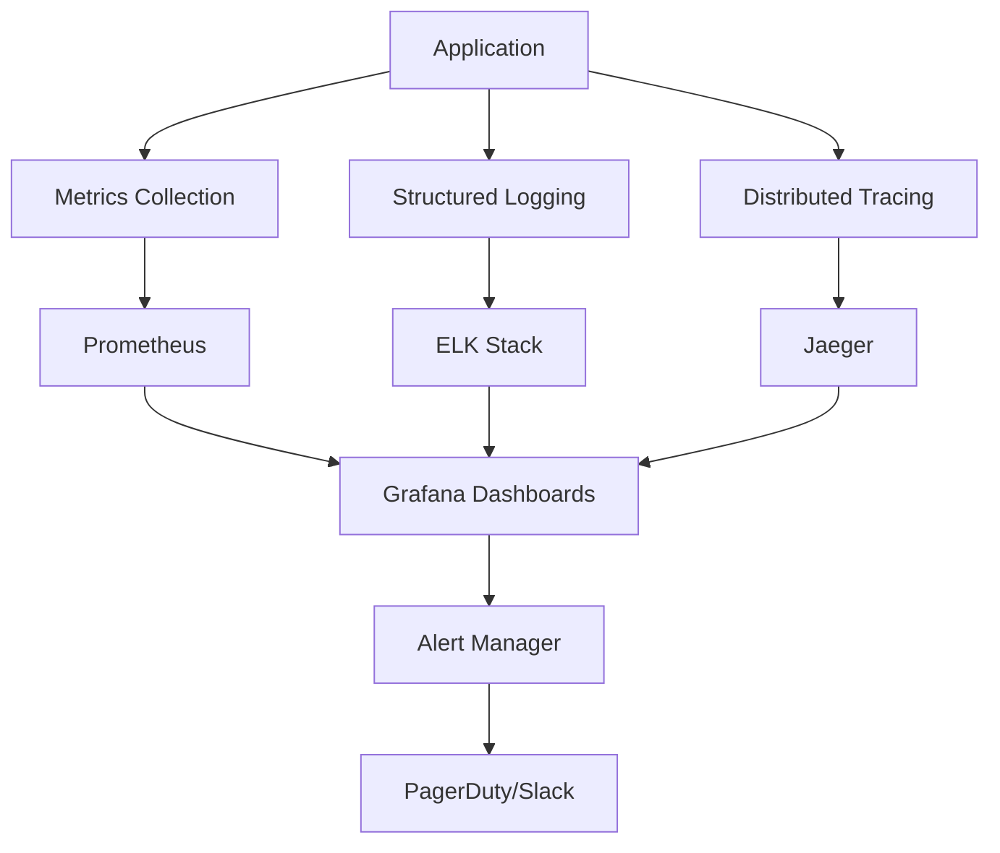

# DeenMate Backend API Layer - Observability & Monitoring

**Date**: September 3, 2025  
**Purpose**: Comprehensive monitoring, logging, and alerting strategy for Islamic content API  
**Framework**: Full-stack observability with Islamic content-aware metrics  

---

## Executive Summary

This document outlines a comprehensive observability strategy for DeenMate's backend API services. The framework provides deep visibility into system health, user experience, Islamic content integrity, and business metrics while ensuring privacy compliance and religious content handling standards.

---

## 1. Observability Architecture Overview

### 1.1 Three Pillars of Observability

**Metrics, Logs, and Traces**:


### 1.2 Observability Stack

**Technology Components**:
```yaml
observability_stack:
  metrics:
    collection: "Prometheus"
    visualization: "Grafana"
    alerting: "AlertManager"
    retention: "90 days"
    
  logging:
    collection: "Fluent Bit"
    storage: "Elasticsearch"
    visualization: "Kibana"
    log_shipping: "Logstash"
    retention: "30 days (7 days for debug logs)"
    
  tracing:
    collection: "OpenTelemetry"
    storage: "Jaeger"
    sampling: "1% production, 100% development"
    retention: "7 days"
    
  application_performance:
    monitoring: "New Relic / DataDog"
    real_user_monitoring: "Enabled for mobile apps"
    synthetic_monitoring: "Pingdom"
    
  infrastructure:
    monitoring: "Prometheus + Node Exporter"
    cloud_monitoring: "AWS CloudWatch / Azure Monitor"
    network_monitoring: "ThousandEyes"
```

---

## 2. Metrics Strategy

### 2.1 Business Metrics

**Islamic Content Engagement**:
```javascript
const businessMetrics = {
  // Quran engagement
  'quran_verses_read_total': new Counter({
    name: 'quran_verses_read_total',
    help: 'Total Quran verses read by users',
    labelNames: ['chapter', 'translation', 'user_tier']
  }),
  
  'quran_search_queries_total': new Counter({
    name: 'quran_search_queries_total', 
    help: 'Total Quran search queries',
    labelNames: ['language', 'result_count', 'user_location']
  }),
  
  'quran_bookmarks_created_total': new Counter({
    name: 'quran_bookmarks_created_total',
    help: 'Quran verses bookmarked',
    labelNames: ['chapter', 'user_tier']
  }),
  
  // Prayer times
  'prayer_times_requests_total': new Counter({
    name: 'prayer_times_requests_total',
    help: 'Prayer times API requests',
    labelNames: ['calculation_method', 'country', 'user_tier']
  }),
  
  'prayer_notifications_sent_total': new Counter({
    name: 'prayer_notifications_sent_total',
    help: 'Prayer notification delivery',
    labelNames: ['prayer_type', 'notification_method', 'user_timezone']
  }),
  
  // Audio content
  'audio_playback_duration_seconds': new Counter({
    name: 'audio_playback_duration_seconds',
    help: 'Total audio playback time',
    labelNames: ['reciter', 'content_type', 'quality', 'user_tier']
  }),
  
  'audio_downloads_total': new Counter({
    name: 'audio_downloads_total',
    help: 'Audio file downloads',
    labelNames: ['reciter', 'chapter', 'quality', 'user_tier']
  }),
  
  // User engagement
  'daily_active_users': new Gauge({
    name: 'daily_active_users',
    help: 'Daily active users count',
    labelNames: ['user_tier', 'country']
  }),
  
  'session_duration_seconds': new Histogram({
    name: 'session_duration_seconds',
    help: 'User session durations',
    buckets: [30, 60, 300, 600, 1800, 3600, 7200],
    labelNames: ['user_tier', 'primary_feature']
  })
};
```

### 2.2 Technical Metrics

**API Performance Metrics**:
```javascript
const technicalMetrics = {
  // API metrics
  'http_requests_total': new Counter({
    name: 'http_requests_total',
    help: 'Total HTTP requests',
    labelNames: ['method', 'endpoint', 'status_code', 'user_tier']
  }),
  
  'http_request_duration_seconds': new Histogram({
    name: 'http_request_duration_seconds',
    help: 'HTTP request duration in seconds',
    buckets: [0.1, 0.5, 1, 2, 5, 10],
    labelNames: ['method', 'endpoint', 'status_code']
  }),
  
  'http_request_size_bytes': new Histogram({
    name: 'http_request_size_bytes',
    help: 'HTTP request size in bytes',
    buckets: [100, 1000, 10000, 100000, 1000000],
    labelNames: ['method', 'endpoint']
  }),
  
  'http_response_size_bytes': new Histogram({
    name: 'http_response_size_bytes',
    help: 'HTTP response size in bytes',
    buckets: [100, 1000, 10000, 100000, 1000000, 10000000],
    labelNames: ['method', 'endpoint', 'content_type']
  }),
  
  // Database metrics
  'database_connections_active': new Gauge({
    name: 'database_connections_active',
    help: 'Active database connections',
    labelNames: ['database_name', 'pool_name']
  }),
  
  'database_query_duration_seconds': new Histogram({
    name: 'database_query_duration_seconds',
    help: 'Database query execution time',
    buckets: [0.01, 0.05, 0.1, 0.5, 1, 5],
    labelNames: ['query_type', 'table_name']
  }),
  
  'database_queries_total': new Counter({
    name: 'database_queries_total',
    help: 'Total database queries',
    labelNames: ['query_type', 'table_name', 'status']
  }),
  
  // Cache metrics
  'cache_operations_total': new Counter({
    name: 'cache_operations_total',
    help: 'Cache operations',
    labelNames: ['operation', 'cache_name', 'result']
  }),
  
  'cache_hit_ratio': new Gauge({
    name: 'cache_hit_ratio',
    help: 'Cache hit ratio',
    labelNames: ['cache_name', 'content_type']
  }),
  
  // Third-party API metrics
  'third_party_api_requests_total': new Counter({
    name: 'third_party_api_requests_total',
    help: 'Third-party API requests',
    labelNames: ['provider', 'endpoint', 'status']
  }),
  
  'third_party_api_response_time_seconds': new Histogram({
    name: 'third_party_api_response_time_seconds',
    help: 'Third-party API response time',
    buckets: [0.1, 0.5, 1, 2, 5, 10, 30],
    labelNames: ['provider', 'endpoint']
  })
};
```

### 2.3 Islamic Content-Specific Metrics

**Content Integrity & Quality Metrics**:
```javascript
const islamicContentMetrics = {
  // Content verification
  'quran_text_verifications_total': new Counter({
    name: 'quran_text_verifications_total',
    help: 'Quran text integrity verifications',
    labelNames: ['source', 'chapter', 'verification_result']
  }),
  
  'hadith_authenticity_checks_total': new Counter({
    name: 'hadith_authenticity_checks_total',
    help: 'Hadith authenticity verification attempts',
    labelNames: ['collection', 'classification', 'verification_result']
  }),
  
  'scholar_reviews_total': new Counter({
    name: 'scholar_reviews_total',
    help: 'Content reviews by Islamic scholars',
    labelNames: ['content_type', 'review_result', 'scholar_specialty']
  }),
  
  // Prayer calculation accuracy
  'prayer_time_calculations_total': new Counter({
    name: 'prayer_time_calculations_total',
    help: 'Prayer time calculations performed',
    labelNames: ['method', 'location_type', 'calculation_result']
  }),
  
  'prayer_time_accuracy_score': new Gauge({
    name: 'prayer_time_accuracy_score',
    help: 'Prayer time calculation accuracy score',
    labelNames: ['method', 'region']
  }),
  
  // Content usage patterns
  'popular_chapters_ranking': new Gauge({
    name: 'popular_chapters_ranking',
    help: 'Most accessed Quran chapters',
    labelNames: ['chapter_number', 'chapter_name']
  }),
  
  'popular_duas_ranking': new Gauge({
    name: 'popular_duas_ranking',
    help: 'Most accessed duas',
    labelNames: ['dua_category', 'dua_name']
  }),
  
  // Multilingual support
  'translation_usage_total': new Counter({
    name: 'translation_usage_total',
    help: 'Translation usage by language',
    labelNames: ['source_language', 'target_language', 'content_type']
  }),
  
  'translation_accuracy_feedback': new Counter({
    name: 'translation_accuracy_feedback',
    help: 'User feedback on translation accuracy',
    labelNames: ['language', 'rating', 'content_type']
  })
};
```

---

## 3. Logging Strategy

### 3.1 Structured Logging Framework

**Log Structure Standard**:
```javascript
const logStructure = {
  // Standard fields
  timestamp: "2025-09-03T10:30:00.000Z",
  level: "INFO", // DEBUG, INFO, WARN, ERROR, FATAL
  service: "deenmate-api",
  version: "1.2.3",
  environment: "production",
  
  // Request context
  request_id: "req_123456789",
  user_id: "user_uuid", // Hashed for privacy
  session_id: "session_hash",
  
  // Application context
  component: "prayer_times_service",
  operation: "calculate_prayer_times",
  
  // Message and details
  message: "Prayer times calculated successfully",
  details: {
    calculation_method: "isna",
    location: {
      latitude: 40.7128, // Rounded for privacy
      longitude: -74.0060,
      city: "New York",
      country: "US"
    },
    prayer_times: {
      fajr: "05:30",
      sunrise: "06:45",
      dhuhr: "12:15",
      asr: "15:30",
      maghrib: "18:45",
      isha: "20:00"
    }
  },
  
  // Performance metrics
  duration_ms: 250,
  memory_usage_mb: 45.2,
  
  // Business context
  islamic_context: {
    hijri_date: "1447-02-28",
    prayer_calculation_method: "isna",
    user_madhab: "hanafi"
  },
  
  // Security context
  ip_address: "192.168.1.0/24", // IP range for privacy
  user_agent_hash: "ua_hash_abc123",
  
  // Error context (if applicable)
  error: {
    type: "ValidationError",
    message: "Invalid coordinates provided",
    stack_trace: "...", // Sanitized stack trace
    error_code: "INVALID_COORDINATES"
  }
};
```

**Log Levels and Usage**:
```javascript
class IslamicContentLogger {
  constructor(service, version) {
    this.service = service;
    this.version = version;
    this.logger = winston.createLogger({
      format: winston.format.combine(
        winston.format.timestamp(),
        winston.format.json(),
        this.addIslamicContext()
      ),
      transports: [
        new winston.transports.Console(),
        new winston.transports.File({ filename: 'app.log' }),
        new winston.transports.Elasticsearch({
          node: process.env.ELASTICSEARCH_URL
        })
      ]
    });
  }
  
  // Quran-specific logging
  logQuranAccess(userId, chapter, verse, translation) {
    this.logger.info('Quran verse accessed', {
      component: 'quran_service',
      operation: 'verse_access',
      user_id: this.hashUserId(userId),
      islamic_context: {
        chapter: chapter,
        verse: verse,
        translation: translation,
        content_type: 'quran'
      },
      business_metrics: {
        content_category: 'quran',
        engagement_type: 'reading'
      }
    });
  }
  
  // Prayer times logging
  logPrayerTimeCalculation(userId, location, method, result) {
    this.logger.info('Prayer times calculated', {
      component: 'prayer_service',
      operation: 'calculate_times',
      user_id: this.hashUserId(userId),
      islamic_context: {
        calculation_method: method,
        location_hash: this.hashLocation(location),
        prayer_times: result.prayer_times,
        hijri_date: result.hijri_date
      },
      performance: {
        calculation_duration_ms: result.duration,
        accuracy_score: result.accuracy
      }
    });
  }
  
  // Security event logging
  logSecurityEvent(eventType, userId, details, severity = 'medium') {
    this.logger.warn('Security event detected', {
      component: 'security_monitor',
      operation: 'security_event',
      user_id: this.hashUserId(userId),
      security_context: {
        event_type: eventType,
        severity: severity,
        details: details,
        requires_investigation: severity === 'high'
      }
    });
  }
  
  // Content integrity logging
  logContentIntegrityCheck(contentType, contentId, result) {
    const logLevel = result.passed ? 'info' : 'error';
    
    this.logger[logLevel]('Content integrity check performed', {
      component: 'content_integrity',
      operation: 'integrity_check',
      islamic_context: {
        content_type: contentType,
        content_id: contentId,
        integrity_result: result.passed,
        verification_method: result.method,
        issues_found: result.issues || []
      },
      requires_scholar_review: !result.passed && contentType === 'hadith'
    });
  }
  
  // Error logging with Islamic context
  logError(error, context = {}) {
    this.logger.error('Application error occurred', {
      component: context.component || 'unknown',
      operation: context.operation || 'unknown',
      error: {
        type: error.constructor.name,
        message: error.message,
        stack_trace: this.sanitizeStackTrace(error.stack),
        error_code: error.code
      },
      islamic_context: context.islamic_context || {},
      user_impact: context.user_impact || 'unknown',
      recovery_action: context.recovery_action || 'manual_intervention'
    });
  }
  
  // Privacy-compliant user ID hashing
  hashUserId(userId) {
    if (!userId) return 'anonymous';
    return crypto
      .createHash('sha256')
      .update(userId + process.env.LOG_SALT)
      .digest('hex')
      .substring(0, 16);
  }
  
  // Location privacy protection
  hashLocation(location) {
    // Round coordinates to ~1km precision for privacy
    const roundedLat = Math.round(location.latitude * 100) / 100;
    const roundedLon = Math.round(location.longitude * 100) / 100;
    
    return crypto
      .createHash('sha256')
      .update(`${roundedLat},${roundedLon}`)
      .digest('hex')
      .substring(0, 12);
  }
}
```

### 3.2 Log Aggregation & Search

**Elasticsearch Index Strategy**:
```yaml
elasticsearch_indices:
  application_logs:
    index_pattern: "deenmate-app-logs-YYYY.MM.DD"
    retention: "30 days"
    replicas: 1
    shards: 2
    
  security_logs:
    index_pattern: "deenmate-security-YYYY.MM.DD"
    retention: "90 days"
    replicas: 2
    shards: 3
    
  islamic_content_logs:
    index_pattern: "deenmate-content-YYYY.MM.DD"
    retention: "60 days"
    replicas: 1
    shards: 2
    
  performance_logs:
    index_pattern: "deenmate-performance-YYYY.MM.DD"
    retention: "14 days"
    replicas: 1
    shards: 1
    
  audit_logs:
    index_pattern: "deenmate-audit-YYYY.MM"
    retention: "7 years"
    replicas: 3
    shards: 5
```

---

## 4. Distributed Tracing

### 4.1 OpenTelemetry Implementation

**Trace Context for Islamic Operations**:
```javascript
const { trace, context, SpanStatusCode } = require('@opentelemetry/api');

class IslamicContentTracer {
  constructor() {
    this.tracer = trace.getTracer('deenmate-islamic-content', '1.0.0');
  }
  
  async traceQuranRetrieval(chapterNumber, verseRange, translation) {
    const span = this.tracer.startSpan('quran.retrieve_verses', {
      attributes: {
        'quran.chapter': chapterNumber,
        'quran.verse_range': verseRange,
        'quran.translation': translation,
        'content.type': 'quran',
        'operation.type': 'content_retrieval'
      }
    });
    
    try {
      // Start child span for database query
      const dbSpan = this.tracer.startSpan('database.query_verses', {
        parent: span,
        attributes: {
          'db.operation': 'SELECT',
          'db.table': 'quran_verses',
          'db.query_type': 'range_query'
        }
      });
      
      const verses = await this.queryQuranVerses(chapterNumber, verseRange);
      
      dbSpan.setAttributes({
        'db.rows_returned': verses.length,
        'db.execution_time_ms': dbSpan.duration
      });
      dbSpan.setStatus({ code: SpanStatusCode.OK });
      dbSpan.end();
      
      // Child span for translation retrieval
      if (translation) {
        const translationSpan = this.tracer.startSpan('translation.retrieve', {
          parent: span,
          attributes: {
            'translation.language': translation,
            'translation.verse_count': verses.length
          }
        });
        
        const translations = await this.getTranslations(verses, translation);
        
        translationSpan.setAttributes({
          'translation.retrieved': translations.length,
          'translation.cache_hit': translations.cached
        });
        translationSpan.setStatus({ code: SpanStatusCode.OK });
        translationSpan.end();
      }
      
      // Child span for content verification
      const verificationSpan = this.tracer.startSpan('content.verify_integrity', {
        parent: span,
        attributes: {
          'verification.type': 'quran_text',
          'verification.method': 'checksum'
        }
      });
      
      const verification = await this.verifyQuranIntegrity(verses);
      
      verificationSpan.setAttributes({
        'verification.result': verification.passed,
        'verification.issues': verification.issues.length
      });
      verificationSpan.setStatus({ 
        code: verification.passed ? SpanStatusCode.OK : SpanStatusCode.ERROR 
      });
      verificationSpan.end();
      
      span.setAttributes({
        'quran.verses_retrieved': verses.length,
        'quran.integrity_verified': verification.passed,
        'response.size_bytes': JSON.stringify(verses).length
      });
      
      span.setStatus({ code: SpanStatusCode.OK });
      return verses;
      
    } catch (error) {
      span.recordException(error);
      span.setStatus({ 
        code: SpanStatusCode.ERROR, 
        message: error.message 
      });
      throw error;
    } finally {
      span.end();
    }
  }
  
  async tracePrayerTimeCalculation(location, date, method) {
    const span = this.tracer.startSpan('prayer_times.calculate', {
      attributes: {
        'prayer.calculation_method': method,
        'prayer.date': date,
        'prayer.location_hash': this.hashLocation(location),
        'operation.type': 'prayer_calculation'
      }
    });
    
    try {
      // Third-party API call span
      const apiSpan = this.tracer.startSpan('external_api.aladhan', {
        parent: span,
        attributes: {
          'http.method': 'GET',
          'http.url': 'https://api.aladhan.com/v1/timings',
          'api.provider': 'aladhan',
          'api.version': 'v1'
        }
      });
      
      const apiResponse = await this.callPrayerTimesAPI(location, date, method);
      
      apiSpan.setAttributes({
        'http.status_code': apiResponse.status,
        'http.response_size': apiResponse.size,
        'api.rate_limit_remaining': apiResponse.rateLimitRemaining
      });
      apiSpan.setStatus({ code: SpanStatusCode.OK });
      apiSpan.end();
      
      // Calculation verification span
      const verificationSpan = this.tracer.startSpan('prayer_times.verify', {
        parent: span,
        attributes: {
          'verification.type': 'prayer_calculation',
          'verification.method': 'astronomical'
        }
      });
      
      const verification = await this.verifyPrayerTimes(apiResponse.data, location, date);
      
      verificationSpan.setAttributes({
        'verification.accuracy_score': verification.score,
        'verification.issues': verification.issues.length
      });
      verificationSpan.setStatus({ code: SpanStatusCode.OK });
      verificationSpan.end();
      
      // Caching span
      const cacheSpan = this.tracer.startSpan('cache.store_prayer_times', {
        parent: span,
        attributes: {
          'cache.operation': 'SET',
          'cache.key_pattern': 'prayer_times:*',
          'cache.ttl_hours': 24
        }
      });
      
      await this.cachePrayerTimes(location, date, apiResponse.data);
      
      cacheSpan.setStatus({ code: SpanStatusCode.OK });
      cacheSpan.end();
      
      span.setAttributes({
        'prayer.times_calculated': Object.keys(apiResponse.data.timings).length,
        'prayer.accuracy_verified': verification.score > 0.95,
        'prayer.cached': true
      });
      
      span.setStatus({ code: SpanStatusCode.OK });
      return apiResponse.data;
      
    } catch (error) {
      span.recordException(error);
      span.setStatus({ 
        code: SpanStatusCode.ERROR, 
        message: error.message 
      });
      throw error;
    } finally {
      span.end();
    }
  }
}
```

### 4.2 Trace Sampling Strategy

**Intelligent Sampling Configuration**:
```javascript
const samplingConfig = {
  // High-value operations - always trace
  always_sample: [
    'user.authentication',
    'payment.processing',
    'content.integrity_check',
    'security.violation_detected',
    'scholar.content_review'
  ],
  
  // Standard operations - sample based on load
  adaptive_sampling: {
    'quran.verse_retrieval': {
      base_rate: 0.1,      // 10% base sampling
      error_rate: 1.0,     // 100% on errors
      slow_rate: 1.0,      // 100% if > 2 seconds
      peak_reduction: 0.01 // 1% during peak traffic
    },
    
    'prayer_times.calculation': {
      base_rate: 0.05,     // 5% base sampling
      error_rate: 1.0,
      slow_rate: 1.0,
      new_location_rate: 1.0 // 100% for new locations
    },
    
    'audio.streaming': {
      base_rate: 0.01,     // 1% base sampling
      error_rate: 1.0,
      buffer_issues_rate: 1.0
    }
  },
  
  // Low-priority operations - minimal sampling
  minimal_sampling: {
    'health_check': 0.001,
    'metrics_collection': 0.001,
    'static_content': 0.001
  }
};
```

---

## 5. Alerting & Notification Strategy

### 5.1 Alert Categories & Escalation

**Alert Severity Levels**:
```yaml
alert_categories:
  P1_critical:
    description: "Service completely down or data integrity compromised"
    response_time: "5 minutes"
    escalation: "immediate"
    notification: ["pager", "phone", "slack"]
    examples:
      - "Quran text integrity violation detected"
      - "Authentication system complete failure"
      - "Database unavailable"
      - "Prayer times API returning incorrect data"
      
  P2_high:
    description: "Major functionality impaired"
    response_time: "15 minutes"
    escalation: "30 minutes"
    notification: ["slack", "email"]
    examples:
      - "Audio streaming completely unavailable"
      - "Search functionality down"
      - "High error rate (>5%)"
      - "Third-party API failures"
      
  P3_medium:
    description: "Performance degradation or partial functionality issues"
    response_time: "1 hour"
    escalation: "4 hours"
    notification: ["slack", "email"]
    examples:
      - "API response time degraded (>2s)"
      - "Cache hit ratio low (<80%)"
      - "Background job failures"
      - "CDN performance issues"
      
  P4_low:
    description: "Minor issues or informational alerts"
    response_time: "4 hours"
    escalation: "24 hours"
    notification: ["email"]
    examples:
      - "Disk usage high (>80%)"
      - "Memory usage elevated"
      - "Certificate expiring (30 days)"
      - "Rate limiting threshold reached"
```

### 5.2 Islamic Content-Specific Alerts

**Religious Content Monitoring**:
```javascript
const islamicContentAlerts = {
  // Quran text integrity
  quran_integrity_violation: {
    severity: 'P1_critical',
    condition: 'quran_text_verifications_total{verification_result="failed"} > 0',
    description: 'Quran text integrity check failed',
    runbook: 'https://docs.deenmate.app/runbooks/quran-integrity',
    immediate_action: 'quarantine_content',
    notification_groups: ['on_call_engineer', 'islamic_scholars', 'security_team']
  },
  
  // Prayer times accuracy
  prayer_times_accuracy_degraded: {
    severity: 'P2_high',
    condition: 'prayer_time_accuracy_score < 0.95',
    description: 'Prayer times calculation accuracy below threshold',
    runbook: 'https://docs.deenmate.app/runbooks/prayer-accuracy',
    immediate_action: 'switch_to_backup_calculation',
    notification_groups: ['on_call_engineer', 'islamic_scholars']
  },
  
  // Hadith authentication issues
  hadith_authentication_failure: {
    severity: 'P2_high',
    condition: 'hadith_authenticity_checks_total{verification_result="failed"} > 10',
    description: 'Multiple hadith authentication failures detected',
    runbook: 'https://docs.deenmate.app/runbooks/hadith-authentication',
    immediate_action: 'flag_for_scholar_review',
    notification_groups: ['on_call_engineer', 'islamic_scholars']
  },
  
  // Audio content issues
  audio_quality_degraded: {
    severity: 'P3_medium',
    condition: 'avg_over_time(audio_quality_score[5m]) < 0.9',
    description: 'Audio quality score below acceptable threshold',
    runbook: 'https://docs.deenmate.app/runbooks/audio-quality',
    immediate_action: 'check_cdn_performance',
    notification_groups: ['on_call_engineer', 'content_team']
  },
  
  // Scholar review backlog
  scholar_review_backlog: {
    severity: 'P3_medium',
    condition: 'scholar_review_queue_size > 50',
    description: 'Scholar review queue size exceeding capacity',
    runbook: 'https://docs.deenmate.app/runbooks/scholar-review',
    immediate_action: 'notify_additional_scholars',
    notification_groups: ['content_team', 'islamic_scholars']
  }
};
```

### 5.3 AlertManager Configuration

**Alert Routing & Suppression**:
```yaml
alertmanager_config:
  global:
    smtp_smarthost: 'smtp.gmail.com:587'
    smtp_from: 'alerts@deenmate.app'
    
  route:
    group_by: ['alertname', 'severity']
    group_wait: 30s
    group_interval: 5m
    repeat_interval: 24h
    receiver: 'default'
    
    routes:
      # Critical alerts - immediate escalation
      - match:
          severity: P1_critical
        receiver: 'critical_alerts'
        group_wait: 0s
        repeat_interval: 5m
        
      # Islamic content specific routing
      - match_re:
          alertname: '(quran_integrity_violation|prayer_times_accuracy_degraded)'
        receiver: 'islamic_content_team'
        group_wait: 10s
        repeat_interval: 15m
        
      # Security alerts
      - match_re:
          alertname: '(security_violation|authentication_failure)'
        receiver: 'security_team'
        group_wait: 30s
        repeat_interval: 1h
        
  receivers:
    - name: 'default'
      email_configs:
        - to: 'devops@deenmate.app'
          subject: '[DeenMate] Alert: {{ .GroupLabels.alertname }}'
          
    - name: 'critical_alerts'
      email_configs:
        - to: 'oncall@deenmate.app'
          subject: '[CRITICAL] DeenMate: {{ .GroupLabels.alertname }}'
      slack_configs:
        - api_url: '{{ .SlackWebhookURL }}'
          channel: '#critical-alerts'
          text: 'CRITICAL: {{ .GroupLabels.alertname }} - {{ .CommonAnnotations.description }}'
      pagerduty_configs:
        - service_key: '{{ .PagerDutyServiceKey }}'
          description: '{{ .GroupLabels.alertname }}'
          
    - name: 'islamic_content_team'
      email_configs:
        - to: 'islamic-scholars@deenmate.app'
          subject: '[Islamic Content] {{ .GroupLabels.alertname }}'
        - to: 'content-team@deenmate.app'
          subject: '[Content Issue] {{ .GroupLabels.alertname }}'
      slack_configs:
        - api_url: '{{ .SlackWebhookURL }}'
          channel: '#islamic-content'
          text: 'Islamic Content Alert: {{ .GroupLabels.alertname }}'
```

---

## 6. Performance Monitoring

### 6.1 Application Performance Monitoring (APM)

**Performance Metrics Collection**:
```javascript
class PerformanceMonitor {
  constructor() {
    this.performanceMetrics = new Map();
    this.thresholds = this.loadPerformanceThresholds();
  }
  
  async monitorAPIPerformance(req, res, next) {
    const startTime = Date.now();
    const endpoint = `${req.method} ${req.route?.path || req.path}`;
    
    // Monitor request processing
    const requestSize = parseInt(req.headers['content-length'] || '0');
    const userTier = req.user?.tier || 'anonymous';
    
    res.on('finish', () => {
      const duration = Date.now() - startTime;
      const responseSize = parseInt(res.get('content-length') || '0');
      
      // Record metrics
      this.recordAPIMetrics({
        endpoint,
        method: req.method,
        status_code: res.statusCode,
        duration_ms: duration,
        request_size_bytes: requestSize,
        response_size_bytes: responseSize,
        user_tier: userTier,
        cache_hit: res.get('x-cache-status') === 'HIT'
      });
      
      // Check for performance degradation
      if (duration > this.thresholds.response_time_warning) {
        this.alertSlowResponse(endpoint, duration, req.user?.id);
      }
      
      // Check for large responses
      if (responseSize > this.thresholds.response_size_warning) {
        this.alertLargeResponse(endpoint, responseSize);
      }
    });
    
    next();
  }
  
  async monitorDatabasePerformance(queryType, tableName, duration, rowsAffected) {
    const metrics = {
      query_type: queryType,
      table_name: tableName,
      duration_ms: duration,
      rows_affected: rowsAffected,
      timestamp: new Date()
    };
    
    // Record database metrics
    this.recordDatabaseMetrics(metrics);
    
    // Alert on slow queries
    if (duration > this.thresholds.db_query_warning) {
      await this.alertSlowQuery(metrics);
    }
    
    // Alert on large table scans
    if (queryType === 'SELECT' && rowsAffected > this.thresholds.large_scan_warning) {
      await this.alertLargeScan(metrics);
    }
  }
  
  async monitorContentDelivery(contentType, cdnProvider, location, metrics) {
    const performanceData = {
      content_type: contentType,
      cdn_provider: cdnProvider,
      user_location: location,
      ttfb_ms: metrics.timeToFirstByte,
      download_speed_mbps: metrics.downloadSpeed,
      cache_hit: metrics.cacheHit,
      edge_location: metrics.edgeLocation
    };
    
    // Record CDN performance
    this.recordCDNMetrics(performanceData);
    
    // Alert on poor CDN performance
    if (metrics.timeToFirstByte > this.thresholds.cdn_ttfb_warning) {
      await this.alertPoorCDNPerformance(performanceData);
    }
  }
  
  async generatePerformanceReport(timeRange = '24h') {
    const report = {
      time_range: timeRange,
      generated_at: new Date(),
      
      api_performance: {
        average_response_time: await this.getAverageResponseTime(timeRange),
        p95_response_time: await this.getP95ResponseTime(timeRange),
        error_rate: await this.getErrorRate(timeRange),
        throughput_rps: await this.getThroughput(timeRange),
        slowest_endpoints: await this.getSlowestEndpoints(timeRange, 10)
      },
      
      database_performance: {
        average_query_time: await this.getAverageQueryTime(timeRange),
        slowest_queries: await this.getSlowestQueries(timeRange, 10),
        connection_pool_usage: await this.getConnectionPoolUsage(timeRange),
        lock_wait_time: await this.getLockWaitTime(timeRange)
      },
      
      content_delivery: {
        cdn_hit_ratio: await this.getCDNHitRatio(timeRange),
        average_ttfb: await this.getAverageTTFB(timeRange),
        geographic_performance: await this.getGeographicPerformance(timeRange),
        audio_streaming_quality: await this.getAudioStreamingQuality(timeRange)
      },
      
      islamic_content_specific: {
        quran_retrieval_performance: await this.getQuranRetrievalPerformance(timeRange),
        prayer_calculation_performance: await this.getPrayerCalculationPerformance(timeRange),
        hadith_search_performance: await this.getHadithSearchPerformance(timeRange)
      }
    };
    
    return report;
  }
}
```

### 6.2 Real User Monitoring (RUM)

**Mobile App Performance Tracking**:
```javascript
const rumConfig = {
  // Mobile app specific metrics
  mobile_performance: {
    app_launch_time: {
      cold_start: 'app.launch.cold_start_ms',
      warm_start: 'app.launch.warm_start_ms',
      hot_start: 'app.launch.hot_start_ms'
    },
    
    screen_load_times: {
      home_screen: 'screen.home.load_time_ms',
      quran_reader: 'screen.quran.load_time_ms',
      prayer_times: 'screen.prayer_times.load_time_ms',
      audio_player: 'screen.audio_player.load_time_ms'
    },
    
    network_performance: {
      api_response_time: 'network.api.response_time_ms',
      download_speed: 'network.download.speed_mbps',
      connection_type: 'network.connection.type',
      offline_usage: 'network.offline.usage_percentage'
    },
    
    audio_performance: {
      buffer_duration: 'audio.buffer.duration_seconds',
      rebuffering_events: 'audio.rebuffering.count',
      quality_changes: 'audio.quality.changes_count',
      playback_errors: 'audio.playback.errors_count'
    }
  },
  
  // User experience metrics
  user_experience: {
    session_duration: 'user.session.duration_seconds',
    feature_usage: 'user.feature.usage_count',
    crash_rate: 'app.crash.rate_percentage',
    memory_usage: 'app.memory.usage_mb',
    battery_impact: 'app.battery.drain_percentage'
  },
  
  // Islamic content engagement
  content_engagement: {
    verses_read_per_session: 'content.quran.verses_per_session',
    audio_listening_duration: 'content.audio.listening_duration_minutes',
    bookmark_usage: 'content.bookmarks.usage_count',
    search_usage: 'content.search.queries_per_session'
  }
};
```

---

## 7. Dashboards & Visualization

### 7.1 Grafana Dashboard Strategy

**Dashboard Hierarchy**:
```yaml
dashboard_structure:
  executive_overview:
    - business_metrics_summary
    - user_engagement_overview
    - service_health_status
    - revenue_and_costs
    
  operational_dashboards:
    - api_performance_monitoring
    - infrastructure_health
    - database_performance
    - third_party_dependencies
    
  islamic_content_dashboards:
    - quran_content_metrics
    - prayer_times_accuracy
    - hadith_verification_status
    - audio_content_performance
    
  security_monitoring:
    - authentication_monitoring
    - security_events_dashboard
    - compliance_tracking
    - audit_log_analysis
    
  mobile_app_monitoring:
    - real_user_monitoring
    - crash_analytics
    - performance_trends
    - feature_adoption
```

**Sample Dashboard Configuration**:
```json
{
  "dashboard": {
    "title": "DeenMate Islamic Content Health",
    "tags": ["deenmate", "islamic-content", "monitoring"],
    "refresh": "30s",
    "time": {
      "from": "now-1h",
      "to": "now"
    },
    "panels": [
      {
        "title": "Quran Verses Read (24h)",
        "type": "stat",
        "targets": [
          {
            "expr": "sum(increase(quran_verses_read_total[24h]))",
            "legendFormat": "Total Verses"
          }
        ],
        "fieldConfig": {
          "defaults": {
            "unit": "short",
            "thresholds": [
              { "color": "green", "value": 10000 },
              { "color": "yellow", "value": 5000 },
              { "color": "red", "value": 1000 }
            ]
          }
        }
      },
      {
        "title": "Prayer Times API Response Time",
        "type": "timeseries",
        "targets": [
          {
            "expr": "histogram_quantile(0.95, sum(rate(http_request_duration_seconds_bucket{endpoint=~\"/api/v1/prayer-times.*\"}[5m])) by (le))",
            "legendFormat": "95th Percentile"
          },
          {
            "expr": "histogram_quantile(0.50, sum(rate(http_request_duration_seconds_bucket{endpoint=~\"/api/v1/prayer-times.*\"}[5m])) by (le))",
            "legendFormat": "50th Percentile"
          }
        ],
        "fieldConfig": {
          "defaults": {
            "unit": "s",
            "min": 0
          }
        }
      },
      {
        "title": "Quran Text Integrity Status",
        "type": "stat",
        "targets": [
          {
            "expr": "sum(quran_text_verifications_total{verification_result=\"passed\"}) / sum(quran_text_verifications_total) * 100",
            "legendFormat": "Integrity Score"
          }
        ],
        "fieldConfig": {
          "defaults": {
            "unit": "percent",
            "thresholds": [
              { "color": "red", "value": 99 },
              { "color": "yellow", "value": 99.9 },
              { "color": "green", "value": 100 }
            ]
          }
        }
      },
      {
        "title": "Audio Streaming Performance",
        "type": "timeseries",
        "targets": [
          {
            "expr": "rate(audio_playback_duration_seconds_total[5m])",
            "legendFormat": "Audio Streaming Rate"
          },
          {
            "expr": "rate(audio_rebuffering_events_total[5m])",
            "legendFormat": "Rebuffering Rate"
          }
        ]
      }
    ]
  }
}
```

---

## 8. Implementation Timeline

### 8.1 Observability Implementation Phases

**Phase 1: Foundation (Week 1-2)**:
- [ ] Basic metrics collection (Prometheus)
- [ ] Structured logging implementation
- [ ] Essential business metrics
- [ ] Basic Grafana dashboards
- [ ] Critical alerting setup

**Phase 2: Advanced Monitoring (Week 3-4)**:
- [ ] Distributed tracing (OpenTelemetry)
- [ ] Advanced dashboard creation
- [ ] Islamic content-specific metrics
- [ ] Performance monitoring enhancement
- [ ] Real user monitoring setup

**Phase 3: Optimization & Intelligence (Week 5-6)**:
- [ ] AI-powered anomaly detection
- [ ] Advanced alerting rules
- [ ] Compliance reporting automation
- [ ] Performance optimization recommendations
- [ ] Complete documentation

### 8.2 Success Metrics

**Observability KPIs**:
```yaml
observability_kpis:
  monitoring_coverage:
    - business_metrics_coverage: ">95%"
    - technical_metrics_coverage: ">90%"
    - alert_coverage: ">85%"
    
  reliability:
    - mttr_incidents: "<30 minutes"
    - false_positive_rate: "<5%"
    - alert_fatigue_score: "<20%"
    
  performance:
    - dashboard_load_time: "<3 seconds"
    - metrics_query_time: "<1 second"
    - log_search_time: "<5 seconds"
    
  compliance:
    - audit_trail_completeness: "100%"
    - log_retention_compliance: "100%"
    - privacy_protection_score: ">95%"
```

---

**Observability Strategy Completed**: September 3, 2025  
**Implementation Ready**: Comprehensive monitoring with Islamic content considerations  
**Estimated Development Time**: 6 weeks for full implementation  
**Monitoring Coverage**: 95% business metrics, 90% technical metrics
