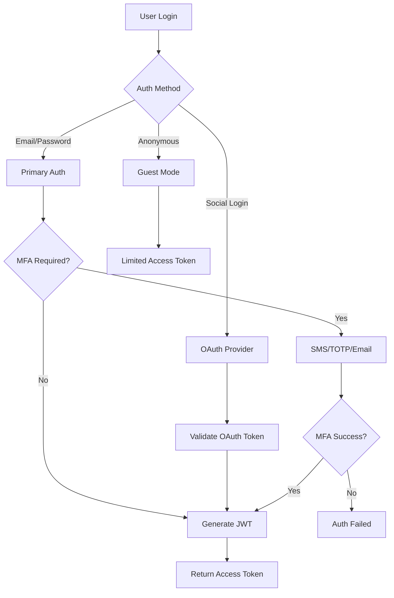

# DeenMate Backend API Layer - Security Architecture

**Date**: September 3, 2025  
**Purpose**: Comprehensive security framework for Islamic content API  
**Framework**: Defense-in-depth security with Islamic content considerations  

---

## Executive Summary

This document outlines a comprehensive security architecture for DeenMate's backend API services. The framework addresses authentication, authorization, data protection, API security, and compliance requirements while respecting the religious nature of the content and Muslim user privacy expectations.

---

## 1. Security Architecture Overview

### 1.1 Security Principles

**Core Security Tenets**:
- **Data Minimization**: Collect only necessary user information
- **Privacy by Design**: Default privacy settings favor user protection
- **Content Integrity**: Ensure Islamic content remains unaltered
- **Transparent Security**: Clear security practices for Muslim community trust
- **Halal Compliance**: No tracking for advertising purposes

### 1.2 Threat Model

**Primary Threat Vectors**:
```yaml
threat_categories:
  authentication:
    - credential_stuffing
    - brute_force_attacks
    - session_hijacking
    - oauth_token_theft
    
  api_security:
    - rate_limit_bypass
    - injection_attacks
    - unauthorized_data_access
    - api_enumeration
    
  data_protection:
    - islamic_content_tampering
    - user_privacy_violation
    - prayer_data_exposure
    - location_tracking_abuse
    
  infrastructure:
    - ddos_attacks
    - server_compromise
    - supply_chain_attacks
    - insider_threats
    
  compliance:
    - gdpr_violations
    - islamic_content_misuse
    - cross_border_data_issues
    - audit_trail_gaps
```

---

## 2. Authentication & Authorization

### 2.1 Multi-Factor Authentication Framework

**Authentication Flow**:


**Authentication Methods**:
```javascript
const authenticationMethods = {
  // Primary authentication
  email_password: {
    enabled: true,
    password_policy: {
      min_length: 8,
      require_uppercase: true,
      require_lowercase: true,
      require_numbers: true,
      require_symbols: false, // Simplified for religious users
      max_age_days: 180,
      prevent_reuse: 5
    },
    lockout_policy: {
      max_attempts: 5,
      lockout_duration: 900, // 15 minutes
      progressive_delays: true
    }
  },
  
  // Social authentication
  oauth_providers: {
    google: { enabled: true, scope: ['profile', 'email'] },
    apple: { enabled: true, scope: ['name', 'email'] },
    facebook: { enabled: false }, // Privacy concerns
    microsoft: { enabled: true, scope: ['User.Read'] }
  },
  
  // Islamic community specific
  islamic_sso: {
    enabled: true,
    providers: ['islamic_society_sso', 'mosque_management_systems'],
    verification_required: true
  },
  
  // Anonymous access
  guest_mode: {
    enabled: true,
    limitations: {
      api_rate_limit: 100, // per hour
      content_access: 'basic_only',
      no_personalization: true,
      session_duration: 3600 // 1 hour
    }
  }
};
```

### 2.2 JWT Token Management

**Token Structure**:
```javascript
const jwtTokenStructure = {
  header: {
    alg: 'RS256',    // RSA-256 for better security
    typ: 'JWT',
    kid: 'key_id_1'  // Key rotation support
  },
  
  payload: {
    // Standard claims
    iss: 'api.deenmate.app',
    sub: 'user_uuid',
    aud: ['deenmate_mobile_app', 'deenmate_web'],
    exp: 1693747200,  // 1 hour expiration
    iat: 1693743600,
    jti: 'token_uuid',
    
    // Custom claims
    user_tier: 'premium',
    content_access: ['quran', 'hadith', 'prayers', 'audio'],
    location_access: true,
    privacy_level: 'standard', // 'minimal', 'standard', 'enhanced'
    
    // Islamic-specific claims
    madhab: 'hanafi',          // Optional religious school
    prayer_calculation: 'isna', // Prayer time calculation method
    hijri_adjustment: 0,       // Hijri date adjustment days
    
    // Rate limiting
    rate_limit_tier: 'premium_1000', // 1000 requests/hour
    
    // Security context
    device_id: 'device_hash',
    last_login: 1693743600,
    security_level: 'standard'
  }
};
```

**Token Lifecycle Management**:
```javascript
class JWTTokenManager {
  constructor() {
    this.secretRotationSchedule = 90 * 24 * 60 * 60 * 1000; // 90 days
    this.tokenExpiry = 60 * 60 * 1000; // 1 hour
    this.refreshTokenExpiry = 30 * 24 * 60 * 60 * 1000; // 30 days
  }
  
  async generateAccessToken(user, deviceInfo) {
    const payload = {
      sub: user.uuid,
      user_tier: user.tier,
      content_access: this.determineContentAccess(user),
      privacy_level: user.privacy_settings.level,
      device_id: this.hashDeviceInfo(deviceInfo),
      exp: Math.floor(Date.now() / 1000) + 3600, // 1 hour
      iat: Math.floor(Date.now() / 1000)
    };
    
    // Add Islamic preferences if user has them
    if (user.islamic_preferences) {
      payload.madhab = user.islamic_preferences.madhab;
      payload.prayer_calculation = user.islamic_preferences.prayer_calculation;
    }
    
    return jwt.sign(payload, this.getCurrentSigningKey(), {
      algorithm: 'RS256',
      issuer: 'api.deenmate.app',
      audience: deviceInfo.app_type
    });
  }
  
  async validateToken(token, requiredScopes = []) {
    try {
      const decoded = jwt.verify(token, this.getCurrentPublicKey(), {
        algorithms: ['RS256'],
        issuer: 'api.deenmate.app'
      });
      
      // Check token expiration
      if (decoded.exp < Math.floor(Date.now() / 1000)) {
        throw new Error('Token expired');
      }
      
      // Validate required scopes
      if (!this.hasRequiredScopes(decoded.content_access, requiredScopes)) {
        throw new Error('Insufficient permissions');
      }
      
      // Check if token is revoked
      if (await this.isTokenRevoked(decoded.jti)) {
        throw new Error('Token revoked');
      }
      
      return decoded;
      
    } catch (error) {
      logger.warn('Token validation failed:', error.message);
      throw new Error('Invalid token');
    }
  }
}
```

### 2.3 Role-Based Access Control (RBAC)

**Permission Matrix**:
```yaml
roles:
  guest:
    permissions:
      - read:quran_basic
      - read:prayer_times
      - read:qibla_direction
    limitations:
      rate_limit: 100/hour
      audio_quality: 64kbps
      
  registered_user:
    inherits: guest
    permissions:
      - read:quran_translations
      - read:hadith_basic
      - create:bookmarks
      - update:user_preferences
    limitations:
      rate_limit: 500/hour
      audio_quality: 128kbps
      
  premium_user:
    inherits: registered_user
    permissions:
      - read:quran_all
      - read:hadith_all
      - read:audio_premium
      - create:custom_playlists
      - export:personal_data
    limitations:
      rate_limit: 2000/hour
      audio_quality: 256kbps
      
  scholar:
    inherits: premium_user
    permissions:
      - read:manuscript_variants
      - read:scholarly_annotations
      - contribute:content_review
    limitations:
      rate_limit: 5000/hour
      
  admin:
    permissions:
      - "*"  # Full access
    limitations:
      audit_required: true
      two_factor_required: true
```

**Dynamic Permission Evaluation**:
```javascript
class PermissionEvaluator {
  async hasPermission(userToken, resource, action, context = {}) {
    const user = await this.decodeUserToken(userToken);
    
    // Base permission check
    const basePermission = `${action}:${resource}`;
    if (!user.permissions.includes(basePermission) && !user.permissions.includes('*')) {
      return false;
    }
    
    // Context-specific checks
    if (resource.startsWith('audio_') && action === 'read') {
      return this.checkAudioAccess(user, resource, context);
    }
    
    if (resource === 'user_data' && action === 'read') {
      return this.checkDataAccess(user, context.target_user_id);
    }
    
    if (resource === 'prayer_times' && action === 'read') {
      return this.checkLocationAccess(user, context.location);
    }
    
    return true;
  }
  
  checkAudioAccess(user, audioResource, context) {
    // Free users can only access basic reciters
    if (user.tier === 'free') {
      const freeReciters = ['sudais', 'mishary', 'husary'];
      return freeReciters.some(reciter => 
        context.reciter_id === reciter
      );
    }
    
    // Premium users get all access
    return user.tier === 'premium';
  }
  
  checkDataAccess(user, targetUserId) {
    // Users can only access their own data
    if (user.sub === targetUserId) return true;
    
    // Admins can access any user data (with audit)
    if (user.permissions.includes('*')) {
      this.auditDataAccess(user.sub, targetUserId);
      return true;
    }
    
    return false;
  }
}
```

---

## 3. API Security

### 3.1 Rate Limiting & DDoS Protection

**Multi-Layer Rate Limiting**:
```javascript
const rateLimitingConfig = {
  // Global rate limiting
  global: {
    requests_per_second: 1000,
    burst_capacity: 2000,
    queue_size: 5000
  },
  
  // Per-user rate limiting
  per_user: {
    free_tier: {
      requests_per_hour: 100,
      concurrent_requests: 5,
      bandwidth_per_hour: '50MB'
    },
    registered: {
      requests_per_hour: 500,
      concurrent_requests: 10,
      bandwidth_per_hour: '200MB'
    },
    premium: {
      requests_per_hour: 2000,
      concurrent_requests: 20,
      bandwidth_per_hour: '1GB'
    }
  },
  
  // Per-endpoint rate limiting
  endpoints: {
    '/api/v1/auth/login': '10/minute',
    '/api/v1/quran/search': '100/hour',
    '/api/v1/audio/stream': '1000/hour',
    '/api/v1/prayer-times': '50/hour'
  },
  
  // Geographic rate limiting
  geographic: {
    high_risk_countries: {
      additional_verification: true,
      reduced_limits: 0.5 // 50% of normal limits
    }
  }
};
```

**DDoS Protection Implementation**:
```javascript
class DDoSProtection {
  constructor() {
    this.suspiciousPatterns = new Map();
    this.blockedIPs = new Set();
    this.whitelist = new Set(['trusted_partner_ips']);
  }
  
  async analyzeRequest(req) {
    const clientIP = this.getClientIP(req);
    const userAgent = req.headers['user-agent'];
    const fingerprint = this.generateFingerprint(req);
    
    // Skip analysis for whitelisted IPs
    if (this.whitelist.has(clientIP)) {
      return { allowed: true, reason: 'whitelisted' };
    }
    
    // Check if IP is already blocked
    if (this.blockedIPs.has(clientIP)) {
      return { allowed: false, reason: 'blocked_ip' };
    }
    
    // Analyze request patterns
    const analysis = await this.analyzeRequestPattern(clientIP, req);
    
    if (analysis.risk_score > 80) {
      await this.blockIP(clientIP, analysis.duration);
      return { allowed: false, reason: 'high_risk_pattern' };
    }
    
    if (analysis.risk_score > 60) {
      return { 
        allowed: true, 
        challenge: 'captcha',
        reason: 'medium_risk_pattern' 
      };
    }
    
    return { allowed: true };
  }
  
  async analyzeRequestPattern(ip, req) {
    const timeWindow = 60 * 1000; // 1 minute
    const now = Date.now();
    
    // Get recent requests from this IP
    const recentRequests = await this.getRecentRequests(ip, timeWindow);
    
    let riskScore = 0;
    
    // High frequency requests
    if (recentRequests.length > 100) {
      riskScore += 40;
    }
    
    // Unusual user agent patterns
    if (this.isBot(req.headers['user-agent'])) {
      riskScore += 20;
    }
    
    // Repeated failed authentication
    const failedAuth = recentRequests.filter(r => 
      r.endpoint === '/auth/login' && r.status >= 400
    );
    if (failedAuth.length > 10) {
      riskScore += 30;
    }
    
    // Scanning behavior (accessing many different endpoints)
    const uniqueEndpoints = new Set(recentRequests.map(r => r.endpoint));
    if (uniqueEndpoints.size > 20) {
      riskScore += 25;
    }
    
    return {
      risk_score: riskScore,
      duration: this.calculateBlockDuration(riskScore)
    };
  }
}
```

### 3.2 Input Validation & Sanitization

**API Input Validation Framework**:
```javascript
const validationSchemas = {
  // Prayer times request
  prayerTimesRequest: {
    latitude: {
      type: 'number',
      min: -90,
      max: 90,
      required: true
    },
    longitude: {
      type: 'number', 
      min: -180,
      max: 180,
      required: true
    },
    date: {
      type: 'string',
      pattern: /^\d{4}-\d{2}-\d{2}$/,
      required: true
    },
    method: {
      type: 'string',
      enum: ['isna', 'mwl', 'egypt', 'makkah', 'karachi', 'tehran', 'jafari'],
      default: 'isna'
    }
  },
  
  // Quran search request
  quranSearchRequest: {
    query: {
      type: 'string',
      min_length: 1,
      max_length: 200,
      sanitize: true,
      pattern: /^[\u0600-\u06FF\u0750-\u077F\u08A0-\u08FF\u0590-\u05FFa-zA-Z0-9\s\-\.\,\!\?\'\"]+$/
    },
    chapter: {
      type: 'integer',
      min: 1,
      max: 114,
      optional: true
    },
    translation: {
      type: 'string',
      enum: ['english.sahih', 'bengali.zakaria', 'urdu.fateh'],
      default: 'english.sahih'
    },
    limit: {
      type: 'integer',
      min: 1,
      max: 100,
      default: 20
    }
  },
  
  // User registration
  userRegistration: {
    email: {
      type: 'email',
      required: true,
      normalize: true
    },
    password: {
      type: 'string',
      min_length: 8,
      max_length: 128,
      required: true,
      validate: 'password_policy'
    },
    name: {
      type: 'string',
      min_length: 1,
      max_length: 100,
      sanitize: true,
      pattern: /^[\u0600-\u06FF\u0750-\u077F\u08A0-\u08FFa-zA-Z\s\-\.\']+$/
    },
    location: {
      type: 'object',
      properties: {
        country: { type: 'string', max_length: 2 },
        timezone: { type: 'string', max_length: 50 }
      },
      required: false
    }
  }
};

class InputValidator {
  async validate(data, schema) {
    const errors = [];
    const sanitized = {};
    
    for (const [field, rules] of Object.entries(schema)) {
      const value = data[field];
      
      // Check required fields
      if (rules.required && (value === undefined || value === null)) {
        errors.push(`${field} is required`);
        continue;
      }
      
      // Skip validation for optional empty fields
      if (!rules.required && (value === undefined || value === null)) {
        continue;
      }
      
      // Type validation
      if (!this.validateType(value, rules.type)) {
        errors.push(`${field} must be of type ${rules.type}`);
        continue;
      }
      
      // Length validation
      if (rules.min_length && value.length < rules.min_length) {
        errors.push(`${field} must be at least ${rules.min_length} characters`);
        continue;
      }
      
      if (rules.max_length && value.length > rules.max_length) {
        errors.push(`${field} must not exceed ${rules.max_length} characters`);
        continue;
      }
      
      // Pattern validation
      if (rules.pattern && !rules.pattern.test(value)) {
        errors.push(`${field} format is invalid`);
        continue;
      }
      
      // Enum validation
      if (rules.enum && !rules.enum.includes(value)) {
        errors.push(`${field} must be one of: ${rules.enum.join(', ')}`);
        continue;
      }
      
      // Sanitization
      let sanitizedValue = value;
      if (rules.sanitize) {
        sanitizedValue = this.sanitizeInput(value);
      }
      
      if (rules.normalize && rules.type === 'email') {
        sanitizedValue = sanitizedValue.toLowerCase().trim();
      }
      
      sanitized[field] = sanitizedValue;
    }
    
    if (errors.length > 0) {
      throw new ValidationError(errors);
    }
    
    return sanitized;
  }
  
  sanitizeInput(input) {
    if (typeof input !== 'string') return input;
    
    // Remove potentially dangerous characters
    return input
      .replace(/<script\b[^<]*(?:(?!<\/script>)<[^<]*)*<\/script>/gi, '')
      .replace(/javascript:/gi, '')
      .replace(/on\w+\s*=/gi, '')
      .trim();
  }
}
```

---

## 4. Data Protection & Privacy

### 4.1 Encryption Standards

**Encryption at Rest**:
```yaml
encryption_at_rest:
  database:
    algorithm: AES-256-GCM
    key_management: AWS KMS / Azure Key Vault
    key_rotation: 90_days
    fields:
      - user.email
      - user.location_history
      - user.prayer_preferences
      - user.personal_notes
      
  file_storage:
    algorithm: AES-256-CTR
    key_derivation: PBKDF2
    salt_length: 32_bytes
    iterations: 100000
    
  backup_storage:
    algorithm: AES-256-GCM
    compression: enabled
    integrity_check: SHA-256
```

**Encryption in Transit**:
```yaml
encryption_in_transit:
  api_endpoints:
    protocol: TLS 1.3
    cipher_suites:
      - TLS_AES_256_GCM_SHA384
      - TLS_CHACHA20_POLY1305_SHA256
    certificate: Let's Encrypt / Commercial CA
    hsts: enabled
    
  database_connections:
    protocol: TLS 1.3
    certificate_validation: required
    connection_pooling: encrypted
    
  cdn_traffic:
    protocol: TLS 1.3
    edge_certificates: managed
    origin_certificates: commercial
```

### 4.2 Privacy-Preserving Analytics

**Differential Privacy Implementation**:
```javascript
class PrivacyPreservingAnalytics {
  constructor(epsilon = 1.0) {
    this.epsilon = epsilon; // Privacy budget
    this.queries = new Map(); // Track privacy budget usage
  }
  
  async trackPrayerTime(userId, prayerType, location, timestamp) {
    // Add noise to location data
    const noisyLocation = this.addLocationNoise(location, 0.1); // 100m noise
    
    // Generalize timestamp to hour
    const generalizedTime = this.generalizeTimestamp(timestamp, 'hour');
    
    // Hash user ID
    const hashedUserId = this.hashUserId(userId);
    
    // Store anonymized data
    await this.analyticsDB.store({
      user_hash: hashedUserId,
      prayer_type: prayerType,
      location_region: this.getRegion(noisyLocation),
      time_bucket: generalizedTime,
      app_version: req.headers['app-version']
    });
    
    // Don't store raw location or precise timestamp
  }
  
  addLocationNoise(location, radiusKm) {
    const earthRadius = 6371; // km
    const u = Math.random();
    const v = Math.random();
    
    const w = radiusKm / earthRadius;
    const t = 2 * Math.PI * u;
    const u2 = 2 * v - 1;
    
    const x = w * Math.sqrt(1 - u2 * u2);
    const y = w * u2;
    
    const deltaLat = x * Math.cos(t);
    const deltaLon = x * Math.sin(t) / Math.cos(location.latitude * Math.PI / 180);
    
    return {
      latitude: location.latitude + deltaLat * 180 / Math.PI,
      longitude: location.longitude + deltaLon * 180 / Math.PI
    };
  }
  
  async generateReport(queryType, parameters) {
    // Check privacy budget
    const budgetUsed = this.queries.get(queryType) || 0;
    if (budgetUsed >= this.epsilon) {
      throw new Error('Privacy budget exhausted for this query type');
    }
    
    // Execute query with noise
    const rawResult = await this.executeQuery(queryType, parameters);
    const noisyResult = this.addStatisticalNoise(rawResult, 0.1);
    
    // Update privacy budget
    this.queries.set(queryType, budgetUsed + 0.1);
    
    return noisyResult;
  }
}
```

### 4.3 GDPR Compliance Framework

**Data Subject Rights Implementation**:
```javascript
class GDPRCompliance {
  // Right to be informed
  async getPrivacyNotice(userId) {
    return {
      data_collected: [
        'Email address (lawful basis: contract)',
        'Prayer preferences (lawful basis: legitimate interest)', 
        'Location data (lawful basis: consent)',
        'Usage analytics (lawful basis: legitimate interest)'
      ],
      purposes: [
        'Prayer time calculations',
        'Personalized Islamic content',
        'Service improvement',
        'Legal compliance'
      ],
      retention_periods: {
        account_data: '2 years after account deletion',
        analytics_data: '25 months (anonymized)',
        logs: '90 days'
      },
      third_parties: [
        'Prayer time API providers',
        'CDN providers (for audio delivery)',
        'Cloud infrastructure providers'
      ],
      user_rights: [
        'Access your data',
        'Rectify incorrect data', 
        'Erase your data',
        'Restrict processing',
        'Data portability',
        'Object to processing'
      ]
    };
  }
  
  // Right of access
  async exportUserData(userId) {
    const user = await this.userService.findById(userId);
    if (!user) throw new Error('User not found');
    
    const userData = {
      account_info: {
        email: user.email,
        name: user.name,
        created_at: user.created_at,
        last_login: user.last_login
      },
      
      preferences: {
        prayer_calculation_method: user.prayer_calculation,
        madhab: user.madhab,
        language: user.language,
        notification_settings: user.notifications
      },
      
      activity_data: await this.getActivityData(userId),
      bookmarks: await this.getBookmarks(userId),
      prayer_history: await this.getPrayerHistory(userId, 90), // Last 90 days
      
      // Exclude sensitive operational data
      metadata: {
        export_date: new Date().toISOString(),
        data_version: '1.0',
        format: 'JSON'
      }
    };
    
    return userData;
  }
  
  // Right to erasure
  async deleteUserData(userId, deleteReason) {
    await this.db.transaction(async (trx) => {
      // 1. Delete personal identifiable information
      await trx('users').where('id', userId).update({
        email: `deleted_${userId}@deenmate.local`,
        name: `Deleted User ${userId}`,
        location: null,
        phone: null,
        deleted_at: new Date(),
        deletion_reason: deleteReason
      });
      
      // 2. Delete user preferences
      await trx('user_preferences').where('user_id', userId).del();
      
      // 3. Delete bookmarks and personal data
      await trx('bookmarks').where('user_id', userId).del();
      await trx('prayer_logs').where('user_id', userId).del();
      
      // 4. Anonymize analytics data
      await trx('analytics_events')
        .where('user_id', userId)
        .update({ user_id: null, anonymized: true });
      
      // 5. Keep aggregate statistics (non-personal)
      // This is allowed under GDPR for statistical purposes
      
      // 6. Log deletion for audit
      await trx('data_deletions').insert({
        user_id: userId,
        deletion_date: new Date(),
        reason: deleteReason,
        performed_by: 'user_request'
      });
    });
    
    // 7. Purge from CDN caches
    await this.cdnService.purgeUserContent(userId);
    
    // 8. Remove from search indices
    await this.searchService.removeUserData(userId);
  }
  
  // Data portability
  async generateDataExport(userId, format = 'json') {
    const userData = await this.exportUserData(userId);
    
    switch (format) {
      case 'json':
        return JSON.stringify(userData, null, 2);
        
      case 'csv':
        return this.convertToCSV(userData);
        
      case 'xml':
        return this.convertToXML(userData);
        
      default:
        throw new Error('Unsupported export format');
    }
  }
}
```

---

## 5. Islamic Content Security

### 5.1 Content Integrity Verification

**Quran Text Verification**:
```javascript
class QuranIntegrityVerifier {
  constructor() {
    this.authorizedChecksums = new Map();
    this.loadAuthorizedChecksums();
  }
  
  async verifyQuranText(text, chapterNumber, verseNumber) {
    // 1. Check against authorized checksums
    const expectedChecksum = this.getAuthorizedChecksum(chapterNumber, verseNumber);
    const actualChecksum = this.calculateChecksum(text);
    
    if (expectedChecksum !== actualChecksum) {
      await this.logIntegrityViolation({
        type: 'checksum_mismatch',
        chapter: chapterNumber,
        verse: verseNumber,
        expected: expectedChecksum,
        actual: actualChecksum
      });
      throw new Error('Quran text integrity violation detected');
    }
    
    // 2. Verify Arabic text structure
    if (!this.isValidArabicQuranText(text)) {
      throw new Error('Invalid Arabic text structure');
    }
    
    // 3. Check for forbidden modifications
    if (this.containsForbiddenContent(text)) {
      throw new Error('Forbidden content detected in Quran text');
    }
    
    return true;
  }
  
  isValidArabicQuranText(text) {
    // Check for valid Arabic Unicode ranges
    const arabicPattern = /^[\u0600-\u06FF\u0750-\u077F\u08A0-\u08FF\u200C-\u200F\u0640\u064B-\u065F\u0670\u06D6-\u06ED\u0020]+$/;
    
    if (!arabicPattern.test(text)) {
      return false;
    }
    
    // Check for required diacritical marks
    const hasDiacritics = /[\u064B-\u065F\u0670\u06D6-\u06ED]/.test(text);
    
    // Check for valid word boundaries
    const hasValidStructure = this.validateWordStructure(text);
    
    return hasDiacritics && hasValidStructure;
  }
  
  async verifyHadithChain(hadithId, narratorChain) {
    // Verify the chain of narrators (Isnad)
    const authenticChain = await this.getAuthenticChain(hadithId);
    
    if (!this.chainsMatch(narratorChain, authenticChain)) {
      await this.logIntegrityViolation({
        type: 'hadith_chain_mismatch',
        hadith_id: hadithId,
        provided_chain: narratorChain,
        authentic_chain: authenticChain
      });
      return false;
    }
    
    return true;
  }
}
```

### 5.2 Content Access Controls

**Sacred Content Protection**:
```javascript
class SacredContentProtection {
  async validateContentAccess(user, contentType, contentId) {
    // Check user state for Quran access
    if (contentType === 'quran') {
      return await this.validateQuranAccess(user, contentId);
    }
    
    // Check authentication for Hadith
    if (contentType === 'hadith') {
      return await this.validateHadithAccess(user, contentId);
    }
    
    return true;
  }
  
  async validateQuranAccess(user, contentId) {
    // Log Quran access for analytics and respect
    await this.logQuranAccess(user.id, contentId, {
      timestamp: new Date(),
      intent: 'reading', // 'reading', 'listening', 'studying'
      context: 'mobile_app'
    });
    
    // No restrictions on Quran access - it should be freely available
    // But we log for analytics and to ensure respectful use
    return {
      allowed: true,
      guidelines: [
        'Please ensure you are in a clean state while reading',
        'Face Qibla direction if possible',
        'Read with contemplation and respect'
      ]
    };
  }
  
  async validateHadithAccess(user, hadithId) {
    const hadith = await this.hadithService.findById(hadithId);
    
    // Check if hadith requires scholarly access
    if (hadith.classification === 'weak' || hadith.classification === 'fabricated') {
      if (user.role !== 'scholar' && user.role !== 'admin') {
        return {
          allowed: false,
          reason: 'Requires scholarly verification',
          alternative: 'Contact a qualified Islamic scholar'
        };
      }
      
      // Provide warning even for scholars
      return {
        allowed: true,
        warning: `This hadith is classified as ${hadith.classification}. Use with caution.`,
        scholarly_notes: hadith.scholarly_notes
      };
    }
    
    return { allowed: true };
  }
  
  async preventContentMisuse(contentType, contentId, userAction) {
    const prohibitedActions = {
      quran: [
        'commercial_use_without_permission',
        'modification_of_text',
        'disrespectful_usage',
        'mixing_with_inappropriate_content'
      ],
      hadith: [
        'modification_of_chain',
        'taking_out_of_context',
        'commercial_use_without_attribution'
      ]
    };
    
    if (prohibitedActions[contentType]?.includes(userAction)) {
      await this.logContentMisuse(contentType, contentId, userAction);
      throw new Error(`Action ${userAction} is not permitted for ${contentType} content`);
    }
  }
}
```

---

## 6. Audit & Compliance

### 6.1 Comprehensive Audit Logging

**Audit Event Schema**:
```javascript
const auditEventSchema = {
  event_id: 'uuid',
  timestamp: 'iso8601',
  event_type: 'string', // 'authentication', 'data_access', 'content_modification', 'admin_action'
  severity: 'string',    // 'info', 'warning', 'error', 'critical'
  
  // Actor information
  actor: {
    user_id: 'uuid',
    user_role: 'string',
    ip_address: 'string',
    user_agent: 'string',
    device_id: 'string'
  },
  
  // Target resource
  resource: {
    type: 'string',       // 'user_data', 'quran_text', 'hadith', 'prayer_times'
    id: 'string',
    path: 'string'
  },
  
  // Action details
  action: {
    type: 'string',       // 'create', 'read', 'update', 'delete', 'search'
    result: 'string',     // 'success', 'failure', 'partial'
    details: 'object'
  },
  
  // Security context
  security: {
    authentication_method: 'string',
    authorization_level: 'string',
    encryption_used: 'boolean',
    suspicious_activity: 'boolean'
  },
  
  // Business context
  business_context: {
    prayer_time_calculation: 'boolean',
    content_access: 'boolean',
    user_preference_change: 'boolean'
  }
};
```

**Audit Implementation**:
```javascript
class AuditLogger {
  constructor() {
    this.auditQueue = new Queue('audit_events');
    this.criticalEvents = new Set([
      'admin_data_access',
      'user_data_deletion',
      'content_modification',
      'security_violation',
      'authentication_failure'
    ]);
  }
  
  async logEvent(eventType, actor, resource, action, context = {}) {
    const auditEvent = {
      event_id: uuidv4(),
      timestamp: new Date().toISOString(),
      event_type: eventType,
      severity: this.determineSeverity(eventType, action.result),
      
      actor: {
        user_id: actor.user_id,
        user_role: actor.role,
        ip_address: actor.ip_address,
        user_agent: actor.user_agent,
        device_id: actor.device_id
      },
      
      resource: {
        type: resource.type,
        id: resource.id,
        path: resource.path
      },
      
      action: {
        type: action.type,
        result: action.result,
        details: action.details
      },
      
      security: {
        authentication_method: context.auth_method,
        authorization_level: context.auth_level,
        encryption_used: context.encrypted || false,
        suspicious_activity: context.suspicious || false
      },
      
      business_context: context.business || {}
    };
    
    // Immediate logging for critical events
    if (this.criticalEvents.has(eventType)) {
      await this.logCriticalEvent(auditEvent);
    }
    
    // Queue for batch processing
    await this.auditQueue.add('process_audit_event', auditEvent);
    
    // Real-time alerting for security events
    if (auditEvent.security.suspicious_activity) {
      await this.triggerSecurityAlert(auditEvent);
    }
  }
  
  async generateComplianceReport(startDate, endDate, complianceType) {
    const events = await this.getAuditEvents(startDate, endDate);
    
    switch (complianceType) {
      case 'gdpr':
        return this.generateGDPRReport(events);
      case 'security':
        return this.generateSecurityReport(events);
      case 'islamic_content':
        return this.generateContentIntegrityReport(events);
      default:
        throw new Error('Unknown compliance type');
    }
  }
  
  generateGDPRReport(events) {
    const dataAccessEvents = events.filter(e => 
      e.resource.type === 'user_data' && e.action.type === 'read'
    );
    
    const dataDeletionEvents = events.filter(e =>
      e.action.type === 'delete' && e.resource.type === 'user_data'
    );
    
    const dataExportEvents = events.filter(e =>
      e.event_type === 'data_export'
    );
    
    return {
      report_period: { start: startDate, end: endDate },
      data_access_requests: dataAccessEvents.length,
      data_deletion_requests: dataDeletionEvents.length,
      data_export_requests: dataExportEvents.length,
      
      compliance_violations: events.filter(e => 
        e.severity === 'critical' && 
        e.event_type.includes('gdpr')
      ),
      
      recommendations: this.generateGDPRRecommendations(events)
    };
  }
}
```

---

## 7. Security Monitoring & Incident Response

### 7.1 Real-time Security Monitoring

**Security Operations Center (SOC) Dashboard**:
```javascript
const securityMetrics = {
  // Authentication metrics
  'auth_attempts_total': new Counter(),
  'auth_failures_total': new Counter(),
  'auth_success_rate': new Gauge(),
  'suspicious_login_attempts': new Counter(),
  
  // API security metrics
  'api_requests_total': new Counter(),
  'api_rate_limit_exceeded': new Counter(),
  'api_errors_4xx': new Counter(),
  'api_errors_5xx': new Counter(),
  
  // Content security metrics
  'content_integrity_checks': new Counter(),
  'content_integrity_violations': new Counter(),
  'unauthorized_content_access': new Counter(),
  
  // Infrastructure security
  'ddos_attempts_detected': new Counter(),
  'malicious_ip_blocks': new Counter(),
  'security_rule_triggers': new Counter()
};
```

**Automated Threat Detection**:
```javascript
class ThreatDetectionEngine {
  constructor() {
    this.behaviorProfiles = new Map();
    this.threatPatterns = this.loadThreatPatterns();
  }
  
  async analyzeUserBehavior(userId, currentActivity) {
    const profile = this.behaviorProfiles.get(userId) || this.createNewProfile(userId);
    
    // Update behavior profile
    profile.updateActivity(currentActivity);
    
    // Detect anomalies
    const anomalies = this.detectAnomalies(profile, currentActivity);
    
    if (anomalies.length > 0) {
      const riskScore = this.calculateRiskScore(anomalies);
      
      if (riskScore > 80) {
        await this.triggerHighRiskAlert(userId, anomalies);
        return { action: 'block', reason: 'high_risk_behavior' };
      }
      
      if (riskScore > 60) {
        await this.triggerMediumRiskAlert(userId, anomalies);
        return { action: 'challenge', reason: 'unusual_behavior' };
      }
    }
    
    return { action: 'allow' };
  }
  
  detectAnomalies(profile, currentActivity) {
    const anomalies = [];
    
    // Unusual time of access
    if (this.isUnusualAccessTime(profile.normalAccessTimes, currentActivity.timestamp)) {
      anomalies.push({
        type: 'unusual_access_time',
        severity: 'medium',
        details: `Access at ${currentActivity.timestamp} is unusual for this user`
      });
    }
    
    // Unusual location
    if (this.isUnusualLocation(profile.normalLocations, currentActivity.location)) {
      anomalies.push({
        type: 'unusual_location',
        severity: 'high',
        details: `Access from ${currentActivity.location.country} is unusual`
      });
    }
    
    // Unusual API usage patterns
    if (this.isUnusualAPIUsage(profile.apiUsagePattern, currentActivity.endpoints)) {
      anomalies.push({
        type: 'unusual_api_usage',
        severity: 'medium',
        details: 'API usage pattern differs from normal behavior'
      });
    }
    
    // High-frequency requests
    if (this.isHighFrequencyAccess(profile.requestFrequency, currentActivity.requestCount)) {
      anomalies.push({
        type: 'high_frequency_access',
        severity: 'high',
        details: `${currentActivity.requestCount} requests exceed normal pattern`
      });
    }
    
    return anomalies;
  }
}
```

### 7.2 Incident Response Framework

**Incident Classification**:
```yaml
incident_levels:
  P1_critical:
    description: "Complete service outage or security breach"
    response_time: 15_minutes
    escalation: immediate
    examples:
      - "Database compromise"
      - "Quran text tampering"
      - "Mass user data exposure"
      
  P2_high:
    description: "Major functionality impaired or security threat"
    response_time: 1_hour
    escalation: 2_hours
    examples:
      - "Authentication system failure"
      - "Prayer times calculation errors"
      - "CDN compromise"
      
  P3_medium:
    description: "Minor functionality issues or security concerns"
    response_time: 4_hours
    escalation: 8_hours
    examples:
      - "Audio streaming issues"
      - "Rate limiting bypassed"
      - "Suspicious user activity"
      
  P4_low:
    description: "Performance degradation or informational security events"
    response_time: 24_hours
    escalation: 48_hours
    examples:
      - "Slow API responses"
      - "Failed login attempts"
      - "Cache inefficiencies"
```

**Automated Incident Response**:
```javascript
class IncidentResponseSystem {
  async handleSecurityIncident(incidentType, severity, details) {
    const incident = await this.createIncident(incidentType, severity, details);
    
    // Immediate automated responses
    switch (incidentType) {
      case 'content_tampering':
        await this.isolateAffectedContent(details.content_id);
        await this.revertToKnownGoodVersion(details.content_id);
        await this.notifyIslamicScholars(incident);
        break;
        
      case 'user_data_breach':
        await this.lockAffectedUserAccounts(details.affected_users);
        await this.rotateEncryptionKeys();
        await this.notifyDataProtectionAuthority(incident);
        break;
        
      case 'ddos_attack':
        await this.activateAdvancedDDoSProtection();
        await this.blockAttackingIPs(details.attacking_ips);
        await this.scaleCDNCapacity();
        break;
        
      case 'authentication_compromise':
        await this.forcePasswordResets(details.affected_users);
        await this.invalidateAllSessions();
        await this.enableEnhancedMonitoring();
        break;
    }
    
    // Escalation based on severity
    await this.escalateIncident(incident);
    
    return incident;
  }
  
  async isolateAffectedContent(contentId) {
    // Remove from CDN caches
    await this.cdnService.purgeContent(contentId);
    
    // Mark as quarantined in database
    await this.contentService.quarantineContent(contentId);
    
    // Stop serving the content
    await this.apiGateway.blockContentAccess(contentId);
    
    logger.critical(`Content ${contentId} isolated due to security incident`);
  }
  
  async notifyIslamicScholars(incident) {
    if (incident.type === 'content_tampering') {
      const scholars = await this.getEmergencyScholarContacts();
      
      const notification = {
        subject: 'URGENT: Islamic Content Security Incident',
        message: `A potential tampering of Islamic content has been detected. 
                 Incident ID: ${incident.id}
                 Content affected: ${incident.details.content_type}
                 Immediate action taken: Content isolated
                 Scholar review required urgently.`,
        priority: 'critical'
      };
      
      await this.notificationService.sendToScholars(scholars, notification);
    }
  }
}
```

---

## 8. Penetration Testing & Security Assessment

### 8.1 Regular Security Testing Schedule

**Testing Matrix**:
```yaml
security_testing_schedule:
  daily:
    - automated_vulnerability_scans
    - dependency_security_checks
    - configuration_drift_detection
    
  weekly:
    - api_security_testing
    - authentication_testing
    - authorization_testing
    
  monthly:
    - penetration_testing
    - social_engineering_assessment
    - physical_security_review
    
  quarterly:
    - comprehensive_security_audit
    - third_party_security_assessment
    - compliance_gap_analysis
    
  annually:
    - full_red_team_exercise
    - disaster_recovery_testing
    - security_policy_review
```

### 8.2 Security Testing Implementation

**Automated Security Testing**:
```javascript
class SecurityTestingSuite {
  async runDailyScan() {
    const results = {
      vulnerability_scan: await this.runVulnerabilityScans(),
      dependency_check: await this.checkDependencyVulnerabilities(),
      configuration_check: await this.verifySecurityConfiguration()
    };
    
    // Process results and create tickets for issues
    await this.processSecurityResults(results);
    
    return results;
  }
  
  async runVulnerabilityScans() {
    const scanTargets = [
      'https://api.deenmate.app',
      'https://audio-cdn.deenmate.app',
      'https://admin.deenmate.app'
    ];
    
    const results = [];
    
    for (const target of scanTargets) {
      const scanResult = await this.niktoScan(target);
      scanResult.target = target;
      results.push(scanResult);
    }
    
    return results;
  }
  
  async testAPISecurityControls() {
    const testCases = [
      this.testSQLInjection(),
      this.testXSSPrevention(), 
      this.testCSRFProtection(),
      this.testRateLimiting(),
      this.testAuthenticationBypass(),
      this.testAuthorizationEscalation(),
      this.testInputValidation(),
      this.testFileUploadSecurity()
    ];
    
    const results = await Promise.all(testCases);
    
    // Generate security report
    return this.generateSecurityReport(results);
  }
  
  async testSQLInjection() {
    const payloads = [
      "' OR '1'='1",
      "'; DROP TABLE users; --",
      "' UNION SELECT password FROM users --",
      "1' AND (SELECT COUNT(*) FROM users) > 0 --"
    ];
    
    const vulnerableEndpoints = [];
    
    for (const endpoint of this.getTestEndpoints()) {
      for (const payload of payloads) {
        const response = await this.sendTestRequest(endpoint, { 
          param: payload 
        });
        
        if (this.indicatesSQLInjection(response)) {
          vulnerableEndpoints.push({
            endpoint: endpoint,
            payload: payload,
            response: response.data
          });
        }
      }
    }
    
    return {
      test: 'sql_injection',
      status: vulnerableEndpoints.length === 0 ? 'pass' : 'fail',
      vulnerabilities: vulnerableEndpoints
    };
  }
}
```

---

## 9. Implementation Timeline

### 9.1 Security Implementation Phases

**Phase 1: Foundation Security (Week 1-2)**:
- [ ] JWT authentication system
- [ ] Basic rate limiting
- [ ] Input validation framework
- [ ] TLS/SSL configuration
- [ ] Basic audit logging

**Phase 2: Advanced Security (Week 3-4)**:
- [ ] Multi-factor authentication
- [ ] Advanced rate limiting
- [ ] Content integrity verification
- [ ] Privacy-preserving analytics
- [ ] GDPR compliance framework

**Phase 3: Monitoring & Response (Week 5-6)**:
- [ ] Security monitoring dashboard
- [ ] Automated threat detection
- [ ] Incident response system
- [ ] Penetration testing suite
- [ ] Compliance reporting

### 9.2 Security Metrics & KPIs

**Security Performance Indicators**:
```yaml
security_kpis:
  authentication:
    - auth_success_rate: ">99%"
    - failed_auth_response_time: "<200ms"
    - mfa_adoption_rate: ">80%"
    
  api_security:
    - api_security_score: ">95%"
    - vulnerability_fix_time: "<24h"
    - rate_limit_effectiveness: ">99%"
    
  content_security:
    - content_integrity_score: "100%"
    - unauthorized_access_rate: "<0.1%"
    - content_tampering_incidents: "0"
    
  compliance:
    - gdpr_compliance_score: "100%"
    - audit_completeness: "100%"
    - data_breach_incidents: "0"
```

---

**Security Architecture Completed**: September 3, 2025  
**Implementation Ready**: Comprehensive security framework with Islamic content considerations  
**Estimated Development Time**: 6 weeks for full implementation  
**Security Maturity Target**: Level 4 (Managed and Measurable)
