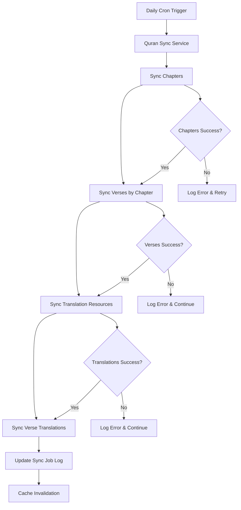
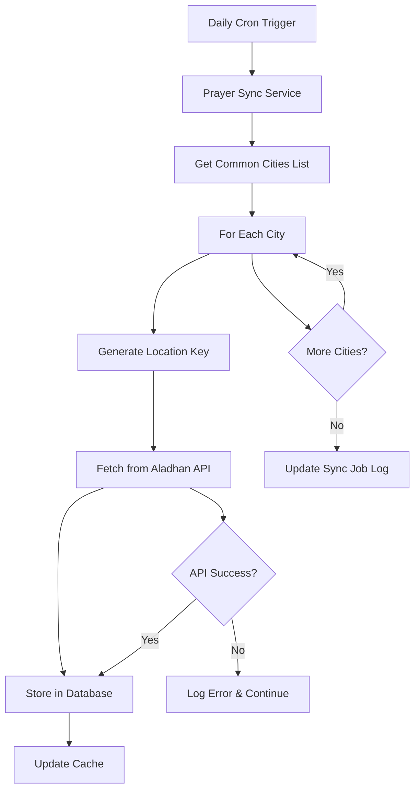

# 🔄 DeenMate Backend — Sync Strategy & Cron Jobs

## 🎯 **Current Phase: Live Sync Implementation**

**Strategy Goal:** Implement robust, scheduled data synchronization from upstream APIs with comprehensive error handling and monitoring  
**Last Updated:** September 4, 2025

---

## 📋 **Sync Strategy Overview**

DeenMate implements a **hybrid sync strategy** that combines:

1. **Scheduled Sync**: Daily cron jobs at 03:00 UTC for bulk data updates
2. **On-Demand Sync**: Real-time fetching when database is empty or stale
3. **Intelligent Caching**: Redis-based caching with appropriate TTLs
4. **Graceful Fallback**: Automatic fallback to upstream APIs when needed

---

## ⏰ **Cron Job Schedule**

### **Daily Sync Jobs**

```bash
# Environment variable
SYNC_CRON_DAILY="0 3 * * *"  # 03:00 UTC daily

# Cron expression breakdown
# ┌───────────── minute (0)
# │ ┌─────────── hour (3)
# │ │ ┌───────── day of month (*)
# │ │ │ ┌─────── month (*)
# │ │ │ │ ┌───── day of week (*)
# │ │ │ │ │
# 0 3 * * *
```

### **Sync Job Timing Rationale**

- **03:00 UTC**: Low traffic period for most regions
- **Daily Frequency**: Ensures data freshness for time-sensitive content
- **Global Coverage**: Works for both Eastern and Western timezones
- **Resource Optimization**: Minimal impact on peak usage hours

---

## 🔄 **Sync Workflows**

### **1. Quran Sync Workflow**



**Sync Steps:**
1. **Chapters**: Pull all 114 chapters from `api.quran.com/api/v4/chapters`
2. **Verses**: For each chapter, pull verses with pagination (50 per page)
3. **Resources**: Pull translation resources from `api.quran.com/api/v4/resources/translations`
4. **Translations**: Pull verse translations for configured resource IDs

**Data Volume:**
- **Chapters**: 114 records
- **Verses**: ~6,236 records (varies by chapter)
- **Resources**: ~50+ translation resources
- **Translations**: ~300,000+ records (varies by language)

### **2. Prayer Sync Workflow**



**Sync Strategy:**
- **Pre-warming**: Common cities pre-warmed daily
- **On-demand**: Additional locations fetched when requested
- **Location Hashing**: 3-decimal precision for location grouping

**Common Cities List:**
```typescript
const COMMON_CITIES = [
  { city: 'Mecca', country: 'Saudi Arabia', lat: 21.4225, lng: 39.8262 },
  { city: 'Medina', country: 'Saudi Arabia', lat: 24.5247, lng: 39.5692 },
  { city: 'Istanbul', country: 'Turkey', lat: 41.0082, lng: 28.9784 },
  { city: 'Jakarta', country: 'Indonesia', lat: -6.2088, lng: 106.8456 },
  { city: 'Dhaka', country: 'Bangladesh', lat: 23.8103, lng: 90.4125 },
  { city: 'Lahore', country: 'Pakistan', lat: 31.5204, lng: 74.3587 },
  { city: 'Cairo', country: 'Egypt', lat: 30.0444, lng: 31.2357 },
  { city: 'Tehran', country: 'Iran', lat: 35.6892, lng: 51.3890 },
  { city: 'Kuala Lumpur', country: 'Malaysia', lat: 3.1390, lng: 101.6869 },
  { city: 'Dubai', country: 'UAE', lat: 25.2048, lng: 55.2708 }
];
```

---

## 🚨 **Error Handling & Resilience**

### **1. Retry Strategy**

```typescript
interface RetryConfig {
  maxRetries: number;           // 3 attempts
  baseDelay: number;           // 1000ms
  maxDelay: number;            // 30000ms
  backoffMultiplier: number;   // 2x exponential
  jitter: boolean;             // true (adds randomness)
}

const DEFAULT_RETRY_CONFIG: RetryConfig = {
  maxRetries: parseInt(process.env.HTTP_MAX_RETRIES || '3', 10),
  baseDelay: parseInt(process.env.HTTP_RETRY_BACKOFF_MS || '1000', 10),
  maxDelay: 30000,
  backoffMultiplier: 2,
  jitter: true
};
```

### **2. Exponential Backoff Algorithm**

```typescript
function calculateBackoff(attempt: number, config: RetryConfig): number {
  const delay = Math.min(
    config.baseDelay * Math.pow(config.backoffMultiplier, attempt),
    config.maxDelay
  );
  
  if (config.jitter) {
    // Add ±25% randomness to prevent thundering herd
    const jitter = delay * 0.25;
    return delay + (Math.random() * 2 - 1) * jitter;
  }
  
  return delay;
}
```

### **3. Circuit Breaker Pattern**

```typescript
class CircuitBreaker {
  private failures = 0;
  private lastFailureTime = 0;
  private state: 'CLOSED' | 'OPEN' | 'HALF_OPEN' = 'CLOSED';
  
  private readonly failureThreshold = 5;
  private readonly recoveryTimeout = 60000; // 1 minute
  
  async execute<T>(fn: () => Promise<T>): Promise<T> {
    if (this.state === 'OPEN') {
      if (Date.now() - this.lastFailureTime > this.recoveryTimeout) {
        this.state = 'HALF_OPEN';
      } else {
        throw new Error('Circuit breaker is OPEN');
      }
    }
    
    try {
      const result = await fn();
      this.onSuccess();
      return result;
    } catch (error) {
      this.onFailure();
      throw error;
    }
  }
  
  private onSuccess(): void {
    this.failures = 0;
    this.state = 'CLOSED';
  }
  
  private onFailure(): void {
    this.failures++;
    this.lastFailureTime = Date.now();
    
    if (this.failures >= this.failureThreshold) {
      this.state = 'OPEN';
    }
  }
}
```

---

## 📊 **Rate Limiting & Throttling**

### **1. Upstream API Rate Limits**

| Service | Rate Limit | Strategy |
|---------|------------|----------|
| **Quran.com** | 1000 req/hour | Respect upstream limits, add delays |
| **Aladhan** | 1000 req/hour | Respect upstream limits, add delays |

### **2. Implementation Strategy**

```typescript
class RateLimiter {
  private requestCounts = new Map<string, number[]>();
  private readonly windowMs = 3600000; // 1 hour
  private readonly maxRequests = 1000;
  
  async checkRateLimit(apiKey: string): Promise<boolean> {
    const now = Date.now();
    const windowStart = now - this.windowMs;
    
    // Get requests in current window
    const requests = this.requestCounts.get(apiKey) || [];
    const recentRequests = requests.filter(timestamp => timestamp > windowStart);
    
    if (recentRequests.length >= this.maxRequests) {
      return false; // Rate limit exceeded
    }
    
    // Add current request
    recentRequests.push(now);
    this.requestCounts.set(apiKey, recentRequests);
    
    return true;
  }
  
  async waitForRateLimit(apiKey: string): Promise<void> {
    while (!(await this.checkRateLimit(apiKey))) {
      const delay = Math.random() * 5000 + 1000; // 1-6 seconds
      await new Promise(resolve => setTimeout(resolve, delay));
    }
  }
}
```

### **3. Throttling Between Requests**

```typescript
class RequestThrottler {
  private lastRequestTime = 0;
  private readonly minInterval = 100; // 100ms between requests
  
  async throttle(): Promise<void> {
    const now = Date.now();
    const timeSinceLastRequest = now - this.lastRequestTime;
    
    if (timeSinceLastRequest < this.minInterval) {
      const delay = this.minInterval - timeSinceLastRequest;
      await new Promise(resolve => setTimeout(resolve, delay));
    }
    
    this.lastRequestTime = Date.now();
  }
}
```

---

## 📝 **Sync Job Logging**

### **1. Database Schema**

```prisma
model SyncJobLog {
  id          Int      @id @default(autoincrement())
  jobName     String   // "quran-daily", "prayer-prewarm"
  resource    String   // "quran-chapters", "quran-verses", "prayer-times"
  startedAt   DateTime @default(now())
  finishedAt  DateTime?
  status      String   // "success" | "failed" | "partial"
  error       String?
  notes       String?
  
  // Performance metrics
  durationMs  Int?     // Total execution time
  recordsProcessed Int? // Number of records processed
  recordsFailed    Int? // Number of records that failed
  
  // Retry information
  retryCount  Int      @default(0)
  lastRetryAt DateTime?
  
  @@index([jobName, status])
  @@index([startedAt])
  @@index([resource])
}
```

### **2. Logging Implementation**

```typescript
class SyncJobLogger {
  constructor(private prisma: PrismaService) {}
  
  async logJobStart(jobName: string, resource: string): Promise<number> {
    const log = await this.prisma.syncJobLog.create({
      data: {
        jobName,
        resource,
        startedAt: new Date(),
        status: 'running'
      }
    });
    
    return log.id;
  }
  
  async logJobSuccess(
    logId: number, 
    durationMs: number, 
    recordsProcessed: number
  ): Promise<void> {
    await this.prisma.syncJobLog.update({
      where: { id: logId },
      data: {
        status: 'success',
        finishedAt: new Date(),
        durationMs,
        recordsProcessed
      }
    });
  }
  
  async logJobFailure(
    logId: number, 
    error: string, 
    retryCount: number = 0
  ): Promise<void> {
    await this.prisma.syncJobLog.update({
      where: { id: logId },
      data: {
        status: 'failed',
        finishedAt: new Date(),
        error,
        retryCount
      }
    });
  }
  
  async logPartialSuccess(
    logId: number,
    durationMs: number,
    recordsProcessed: number,
    recordsFailed: number,
    notes: string
  ): Promise<void> {
    await this.prisma.syncJobLog.update({
      where: { id: logId },
      data: {
        status: 'partial',
        finishedAt: new Date(),
        durationMs,
        recordsProcessed,
        recordsFailed,
        notes
      }
    });
  }
}
```

---

## 🔍 **Monitoring & Alerting**

### **1. Key Metrics to Track**

| Metric | Description | Alert Threshold |
|--------|-------------|-----------------|
| **Sync Success Rate** | Percentage of successful sync jobs | < 90% |
| **Sync Duration** | Time taken for sync jobs | > 30 minutes |
| **Error Rate** | Percentage of failed requests | > 5% |
| **Data Freshness** | Age of most recent data | > 48 hours |
| **Upstream Availability** | Upstream API response time | > 10 seconds |

### **2. Health Check Endpoints**

```typescript
@Controller('admin/health')
export class HealthController {
  @Get('sync')
  async getSyncHealth() {
    const recentJobs = await this.prisma.syncJobLog.findMany({
      where: {
        startedAt: {
          gte: new Date(Date.now() - 24 * 60 * 60 * 1000) // Last 24 hours
        }
      },
      orderBy: { startedAt: 'desc' },
      take: 10
    });
    
    const successRate = recentJobs.filter(job => job.status === 'success').length / recentJobs.length;
    const avgDuration = recentJobs.reduce((sum, job) => sum + (job.durationMs || 0), 0) / recentJobs.length;
    
    return {
      status: successRate > 0.9 ? 'healthy' : 'degraded',
      metrics: {
        successRate: Math.round(successRate * 100),
        averageDurationMs: Math.round(avgDuration),
        totalJobs: recentJobs.length,
        lastSync: recentJobs[0]?.startedAt
      }
    };
  }
}
```

### **3. Alerting Rules**

```yaml
# Prometheus Alerting Rules
groups:
  - name: deenmate-sync
    rules:
      - alert: SyncJobFailure
        expr: rate(sync_job_failures_total[5m]) > 0.1
        for: 5m
        labels:
          severity: warning
        annotations:
          summary: "Sync job failures detected"
          description: "Sync jobs are failing at {{ $value }} failures per second"
      
      - alert: SyncJobDuration
        expr: sync_job_duration_seconds > 1800
        for: 1m
        labels:
          severity: warning
        annotations:
          summary: "Sync job taking too long"
          description: "Sync job has been running for {{ $value }} seconds"
      
      - alert: DataStale
        expr: time() - sync_job_last_success_timestamp > 86400
        for: 1h
        labels:
          severity: critical
        annotations:
          summary: "Data is stale"
          description: "Last successful sync was {{ $value }} seconds ago"
```

---

## 🚀 **Performance Optimization**

### **1. Batch Processing**

```typescript
class BatchProcessor {
  private readonly batchSize = 100;
  
  async processInBatches<T, R>(
    items: T[],
    processor: (batch: T[]) => Promise<R[]>
  ): Promise<R[]> {
    const results: R[] = [];
    
    for (let i = 0; i < items.length; i += this.batchSize) {
      const batch = items.slice(i, i + this.batchSize);
      const batchResults = await processor(batch);
      results.push(...batchResults);
      
      // Add delay between batches to respect rate limits
      if (i + this.batchSize < items.length) {
        await new Promise(resolve => setTimeout(resolve, 1000));
      }
    }
    
    return results;
  }
}
```

### **2. Parallel Processing**

```typescript
class ParallelProcessor {
  private readonly maxConcurrency = 5;
  
  async processParallel<T, R>(
    items: T[],
    processor: (item: T) => Promise<R>
  ): Promise<R[]> {
    const semaphore = new Semaphore(this.maxConcurrency);
    const results: R[] = new Array(items.length);
    
    const promises = items.map(async (item, index) => {
      await semaphore.acquire();
      try {
        results[index] = await processor(item);
      } finally {
        semaphore.release();
      }
    });
    
    await Promise.all(promises);
    return results;
  }
}
```

### **3. Caching Strategy**

```typescript
class SyncCacheManager {
  constructor(private redis: RedisService) {}
  
  async invalidateCache(resource: string): Promise<void> {
    const pattern = `*:${resource}:*`;
    const keys = await this.redis.keys(pattern);
    
    if (keys.length > 0) {
      await this.redis.del(...keys);
    }
  }
  
  async setCacheWithTTL(
    key: string, 
    value: any, 
    ttl: number
  ): Promise<void> {
    await this.redis.set(key, JSON.stringify(value), ttl);
  }
  
  async getCache(key: string): Promise<any | null> {
    const cached = await this.redis.get(key);
    return cached ? JSON.parse(cached) : null;
  }
}
```

---

## 🔧 **Configuration Management**

### **1. Environment Variables**

```bash
# Sync Configuration
SYNC_CRON_DAILY="0 3 * * *"
SYNC_ENABLED=true
SYNC_MAX_RETRIES=3
SYNC_RETRY_DELAY_MS=1000

# HTTP Configuration
HTTP_TIMEOUT_MS=15000
HTTP_MAX_RETRIES=3
HTTP_RETRY_BACKOFF_MS=500
HTTP_RATE_LIMIT_DELAY_MS=100

# Upstream APIs
QURAN_API_BASE=https://api.quran.com/api/v4
ALADHAN_API_BASE=https://api.aladhan.com/v1
QURAN_API_KEY=
ALADHAN_API_KEY=

# Feature Flags
ENABLE_UPSTREAM_PROXY=true
ENABLE_CIRCUIT_BREAKER=true
ENABLE_RATE_LIMITING=true
ENABLE_BATCH_PROCESSING=true
```

### **2. Configuration Validation**

```typescript
class SyncConfigValidator {
  validateConfig(): void {
    const required = [
      'QURAN_API_BASE',
      'ALADHAN_API_BASE',
      'SYNC_CRON_DAILY'
    ];
    
    for (const key of required) {
      if (!process.env[key]) {
        throw new Error(`Missing required environment variable: ${key}`);
      }
    }
    
    // Validate cron expression
    if (!cron.validate(process.env.SYNC_CRON_DAILY!)) {
      throw new Error(`Invalid cron expression: ${process.env.SYNC_CRON_DAILY}`);
    }
  }
}
```

---

## 📚 **Testing Strategy**

### **1. Unit Tests**

```typescript
describe('SyncService', () => {
  it('should handle upstream API failures gracefully', async () => {
    // Mock upstream API failure
    jest.spyOn(httpService, 'get').mockRejectedValue(new Error('API Unavailable'));
    
    // Should not throw, should log error
    await expect(syncService.syncChapters()).resolves.not.toThrow();
    
    // Verify error was logged
    expect(logger.error).toHaveBeenCalledWith(
      'Failed to sync chapters from upstream',
      expect.any(Error)
    );
  });
  
  it('should implement exponential backoff correctly', async () => {
    const delays: number[] = [];
    
    jest.spyOn(global, 'setTimeout').mockImplementation((fn, delay) => {
      delays.push(delay);
      return {} as any;
    });
    
    // Mock API to fail twice then succeed
    let callCount = 0;
    jest.spyOn(httpService, 'get').mockImplementation(() => {
      callCount++;
      if (callCount <= 2) {
        throw new Error('API Error');
      }
      return Promise.resolve({ data: mockData });
    });
    
    await syncService.syncChapters();
    
    // Should have exponential backoff delays
    expect(delays[0]).toBe(1000);  // 1 second
    expect(delays[1]).toBe(2000);  // 2 seconds
  });
});
```

### **2. Integration Tests**

```typescript
describe('Sync Integration', () => {
  it('should complete full sync workflow', async () => {
    // Mock upstream APIs
    mockQuranAPI();
    mockAladhanAPI();
    
    // Run sync
    await syncService.runDailySync();
    
    // Verify database was populated
    const chapters = await prisma.quranChapter.findMany();
    expect(chapters).toHaveLength(114);
    
    const verses = await prisma.quranVerse.findMany();
    expect(verses.length).toBeGreaterThan(6000);
    
    // Verify sync job was logged
    const syncLog = await prisma.syncJobLog.findFirst({
      where: { jobName: 'quran-daily' }
    });
    expect(syncLog?.status).toBe('success');
  });
});
```

---

## 🔗 **Related Documents**

- `docs/backend/TODO.md` - Implementation tasks and progress
- `docs/backend/PROJECT_TRACKING.md` - Sprint board and timeline
- `docs/backend/IMPLEMENTATION_PLAN.md` - Detailed implementation steps
- `docs/backend/MODULE_BREAKDOWN.md` - Module architecture and responsibilities
- `docs/backend/api-spec.md` - API specifications and compatibility matrix

---

## 📝 **Implementation Notes**

### **Key Design Decisions**

1. **Hybrid Sync Strategy**: Combines scheduled and on-demand sync for optimal performance
2. **Exponential Backoff**: Prevents overwhelming upstream APIs during failures
3. **Circuit Breaker**: Protects system from cascading failures
4. **Comprehensive Logging**: Tracks all sync operations for debugging and monitoring
5. **Graceful Degradation**: System continues to function even when sync fails

### **Performance Considerations**

- **Batch Processing**: Reduces database round trips
- **Parallel Processing**: Improves sync speed while respecting rate limits
- **Intelligent Caching**: Minimizes redundant API calls
- **Connection Pooling**: Efficient HTTP client management

### **Monitoring & Observability**

- **Real-time Metrics**: Track sync performance and health
- **Alerting**: Proactive notification of issues
- **Logging**: Comprehensive audit trail of all operations
- **Health Checks**: Endpoint availability and data freshness

---

*Last updated: September 4, 2025*
